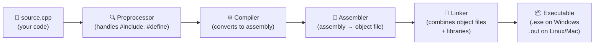
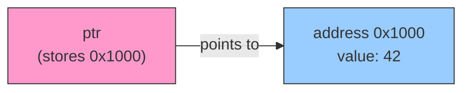

# ⚙️ C++ — From Zero to Confident

> _"C++ gives you the power of a racing car and the responsibility of maintaining it yourself. Learning it teaches you everything about how computers actually work."_

---

```
╔══════════════════════════════════════════════════════════════════════════════╗
║                                                                              ║
║   Python:  "I'll manage memory for you."   → Easy. Slower.                  ║
║   C++:     "You manage memory yourself."   → Hard. Blazingly fast.          ║
║                                                                              ║
║   C++ is what powers: game engines, operating systems, browsers,            ║
║   trading systems, embedded devices, and basically all performance-          ║
║   critical software on the planet.                                          ║
║                                                                              ║
╚══════════════════════════════════════════════════════════════════════════════╝
```

---

## Table of Contents

1. [Why C++?](#1-why-c)
2. [How C++ Works — Compilation](#2-how-c-works--compilation)
3. [Your First C++ Program](#3-your-first-c-program)
4. [Variables and Data Types](#4-variables-and-data-types)
5. [Operators](#5-operators)
6. [Control Flow — if, else, switch](#6-control-flow--if-else-switch)
7. [Loops — for, while, do-while](#7-loops--for-while-do-while)
8. [Functions](#8-functions)
9. [Arrays and Strings](#9-arrays-and-strings)
10. [Pointers and References — the hardest part](#10-pointers-and-references--the-hardest-part)
11. [Memory Management — heap vs stack](#11-memory-management--heap-vs-stack)
12. [Object Oriented Programming in C++](#12-object-oriented-programming-in-c)
13. [The Standard Template Library (STL)](#13-the-standard-template-library-stl)
14. [Templates](#14-templates)
15. [Modern C++ (C++11 and beyond)](#15-modern-c-c11-and-beyond)
16. [Error Handling in C++](#16-error-handling-in-c)
17. [File Handling](#17-file-handling)
18. [Common Patterns and Best Practices](#18-common-patterns-and-best-practices)
19. [C++ vs Python — When to Use Which](#19-c-vs-python--when-to-use-which)
20. [Glossary](#20-glossary)

---

## 1. Why C++?

### The honest answer

C++ is harder than Python. But it teaches you how computers _actually work_ — memory, pointers, the stack, the heap. After learning C++, every other language feels easy and you understand _why_ things work the way they do.

### Where C++ dominates

| Domain                     | Examples                               | Why C++                                            |
| -------------------------- | -------------------------------------- | -------------------------------------------------- |
| **Game Engines**           | Unreal Engine, id Tech, CryEngine      | Maximum performance, direct hardware control       |
| **Operating Systems**      | Windows kernel components, macOS parts | Low-level memory and hardware access               |
| **Browsers**               | Chrome (V8 engine), Firefox            | Rendering millions of elements at 60fps            |
| **High-Frequency Trading** | Every major trading firm               | Microsecond latency — nanoseconds matter           |
| **Embedded Systems**       | Cars, planes, medical devices          | Small memory footprint, no runtime overhead        |
| **Compilers**              | GCC, Clang, LLVM                       | Compilers are written in the language they compile |
| **Databases**              | MySQL, MongoDB, SQLite                 | Storage engines need raw performance               |
| **Scientific Computing**   | Physics simulations, ray tracing       | Numerical performance                              |

### C++ is NOT great for

| Task                          | Use instead         |
| ----------------------------- | ------------------- |
| Quick scripting / automation  | Python              |
| Web backend APIs              | Python, Go, Node.js |
| Mobile apps                   | Swift, Kotlin       |
| Data science / ML experiments | Python              |
| Rapid prototyping             | Python, JavaScript  |

---

## 2. How C++ Works — Compilation

### The key difference: C++ is compiled

```
╔══════════════════════════════════════════════════════════════════════╗
║  Python (Interpreted)                                                ║
║                                                                      ║
║  code.py → Interpreter → runs line by line → output                 ║
║  Translation happens WHILE running                                   ║
╠══════════════════════════════════════════════════════════════════════╣
║  C++ (Compiled)                                                      ║
║                                                                      ║
║  code.cpp → Compiler → machine code (.exe/.out) → run               ║
║  Translation happens ONCE, upfront                                   ║
║  The result is fast native binary that runs directly on CPU          ║
╚══════════════════════════════════════════════════════════════════════╝
```

**Analogy:** Python is a live human translator (slow but flexible). C++ is a pre-translated book (fast because the work was already done).

### The compilation pipeline



### Compiling and running

```bash
# Compile
g++ -o my_program source.cpp

# The -o flag names the output file
# Run it
./my_program        # Linux / Mac
my_program.exe      # Windows

# Compile with C++17 standard (recommended)
g++ -std=c++17 -o my_program source.cpp

# Compile with warnings turned on (always do this while learning)
g++ -std=c++17 -Wall -Wextra -o my_program source.cpp
```

---

## 3. Your First C++ Program

```cpp
#include <iostream>    // include the input/output library
using namespace std;   // so we can write "cout" instead of "std::cout"

int main() {           // every C++ program starts here
    cout << "Hello, World!" << endl;
    return 0;          // 0 = success
}
```

### Breaking it down line by line

```
#include <iostream>
↑ "Include this header file" — imports code from the standard library
  iostream = input/output stream (lets you use cin and cout)

using namespace std;
↑ Everything in the "std" namespace doesn't need "std::" prefix
  Without this: std::cout << "Hi"; → With this: cout << "Hi";

int main() { ... }
↑ The ENTRY POINT — the first function that runs when you execute the program
  int = returns an integer (the exit code)
  main() = always the starting function

cout << "Hello, World!" << endl;
↑ cout = character output (your screen)
  << = the "insertion" operator — feeds data into cout
  endl = end of line (like pressing Enter) + flushes the buffer

return 0;
↑ Exit code 0 = program finished successfully
  Any non-zero = something went wrong (operating system reads this)
```

---

## 4. Variables and Data Types

### C++ is statically typed — you must declare the type

```cpp
int age = 28;             // whole numbers
double height = 5.9;      // decimal numbers (64-bit)
float temperature = 98.6f; // decimal (32-bit) — note the 'f' suffix
char grade = 'A';         // single character — note single quotes
bool isStudent = true;    // true or false
string name = "Alice";    // text — requires #include <string>
```

### Fundamental types and their sizes

```
╔══════════════════════════════════════════════════════════════════╗
║  TYPE          SIZE        RANGE / USE                           ║
╠══════════════════════════════════════════════════════════════════╣
║  bool          1 byte      true / false                          ║
║  char          1 byte      single character 'A', '5', '!'       ║
║  int           4 bytes     -2.1B to 2.1B (whole numbers)        ║
║  long long     8 bytes     much larger whole numbers             ║
║  float         4 bytes     ~7 decimal digits precision           ║
║  double        8 bytes     ~15 decimal digits precision          ║
║  unsigned int  4 bytes     0 to 4.2B (no negatives)             ║
╚══════════════════════════════════════════════════════════════════╝
```

### `auto` — let the compiler figure out the type

```cpp
auto x = 42;           // int
auto y = 3.14;         // double
auto name = "Alice";   // const char*  (use string for text instead)
auto z = true;         // bool

// Very useful with complex types (saves a lot of typing)
auto it = myVector.begin();   // much nicer than: vector<int>::iterator it
```

### Constants

```cpp
const double PI = 3.14159265;    // cannot be changed after declaration
const int MAX_SIZE = 100;

// Modern C++ way (preferred):
constexpr double PI = 3.14159265;    // evaluated at compile time (faster)
```

### Type conversion

```cpp
int x = 5;
double y = (double)x;     // C-style cast
double z = static_cast<double>(x);  // C++ style cast (preferred)

// Implicit conversion (automatic but be careful!)
int a = 5;
double b = a;    // a is automatically converted to 5.0

// Narrowing (loses data — compiler warns you)
double pi = 3.14;
int truncated = (int)pi;   // truncated = 3 — decimal part lost!
```

---

## 5. Operators

### Arithmetic

```cpp
10 + 3    // 13
10 - 3    // 7
10 * 3    // 30
10 / 3    // 3   ← INTEGER division (both ints = no decimal!)
10 / 3.0  // 3.333... ← FLOAT division (one of them is a double)
10 % 3    // 1   — modulus (remainder)

// Pre vs Post increment
int x = 5;
int a = ++x;   // x becomes 6 FIRST, then a = 6
int b = x++;   // b = 6 (current x), THEN x becomes 7
```

### Comparison

```cpp
5 == 5     // true
5 != 3     // true
5 > 3      // true
5 < 3      // false
5 >= 5     // true
5 <= 4     // false
```

### Logical

```cpp
true && false    // false — AND (both must be true)
true || false    // true  — OR  (at least one must be true)
!true            // false — NOT

// Short-circuit evaluation:
if (ptr != nullptr && ptr->value > 0)  // safe — checks ptr first
```

### Bitwise (useful for flags, permissions, performance)

```cpp
5 & 3    // 001 — AND
5 | 3    // 111 — OR
5 ^ 3    // 110 — XOR (exclusive or)
~5       // flip all bits
5 << 1   // 10  — left shift (multiply by 2)
5 >> 1   // 2   — right shift (divide by 2)
```

---

## 6. Control Flow — if, else, switch

```cpp
int score = 85;

if (score >= 90) {
    cout << "A grade" << endl;
} else if (score >= 80) {
    cout << "B grade" << endl;    // this runs
} else if (score >= 70) {
    cout << "C grade" << endl;
} else {
    cout << "Below C" << endl;
}
```

### Switch — for exact value matching

```cpp
char grade = 'B';

switch (grade) {
    case 'A':
        cout << "Excellent" << endl;
        break;              // ALWAYS include break or it falls through!
    case 'B':
        cout << "Good" << endl;    // this runs
        break;
    case 'C':
        cout << "Average" << endl;
        break;
    default:                // like "else"
        cout << "Invalid grade" << endl;
}
```

**Warning:** If you forget `break`, execution "falls through" to the next case. This is a very common bug.

### Ternary operator

```cpp
int age = 20;
string status = (age >= 18) ? "adult" : "minor";   // condition ? if_true : if_false
```

---

## 7. Loops — for, while, do-while

### for loop

```cpp
// Traditional for loop
for (int i = 0; i < 5; i++) {
    cout << i << " ";    // 0 1 2 3 4
}

// Range-based for loop (modern C++ — use this when possible)
vector<int> numbers = {1, 2, 3, 4, 5};
for (int num : numbers) {
    cout << num << " ";    // 1 2 3 4 5
}

// Range-based with auto
for (auto num : numbers) {
    cout << num << " ";
}

// Range-based with reference (avoids copying — important for large objects)
for (const auto& num : numbers) {
    cout << num << " ";
}
```

### while loop

```cpp
int count = 0;
while (count < 5) {
    cout << count << endl;
    count++;    // MUST update the condition or loop forever
}
```

### do-while — runs at least once

```cpp
int input;
do {
    cout << "Enter a positive number: ";
    cin >> input;
} while (input <= 0);    // keeps asking if input is not positive
```

### Loop control

```cpp
for (int i = 0; i < 10; i++) {
    if (i == 5) break;        // exit loop — prints 0,1,2,3,4
    if (i % 2 == 0) continue; // skip even — prints 1,3
    cout << i << " ";
}
```

---

## 8. Functions

```cpp
// Function declaration (prototype) — tells compiler the function exists
int add(int a, int b);

int main() {
    cout << add(3, 4) << endl;   // 7
    return 0;
}

// Function definition
int add(int a, int b) {
    return a + b;
}
```

### Function with default parameters

```cpp
void greet(string name, string greeting = "Hello") {
    cout << greeting << ", " << name << "!" << endl;
}

greet("Alice");          // Hello, Alice!
greet("Bob", "Hi");      // Hi, Bob!
```

### Function overloading — same name, different parameters

```cpp
int add(int a, int b) {
    return a + b;
}

double add(double a, double b) {
    return a + b;
}

string add(string a, string b) {
    return a + b;
}

// Compiler picks the right one based on argument types:
add(1, 2)            // → int version → 3
add(1.5, 2.5)        // → double version → 4.0
add("Hello ", "C++") // → string version → "Hello C++"
```

### Pass by value vs pass by reference

```python
# In Python, everything is passed by reference automatically
def double_it(x):
    x = x * 2   # doesn't change original!
```

```cpp
// In C++, you explicitly choose:

// Pass by VALUE — a COPY is made, original unchanged
void doubleValue(int x) {
    x = x * 2;            // only changes the local copy
}

// Pass by REFERENCE — works on the ORIGINAL variable
void doubleRef(int& x) {   // & means reference
    x = x * 2;             // changes the original!
}

// Pass by CONST REFERENCE — read original, don't copy (efficient for big objects)
void printName(const string& name) {
    cout << name;          // can read but not modify
}

int main() {
    int num = 5;
    doubleValue(num);  // num is still 5
    doubleRef(num);    // num is now 10
    return 0;
}
```

### Inline functions and the call stack

```
╔══════════════════════════════════════════════════════════════╗
║  Every function call pushes a "stack frame" onto the stack   ║
║  with: return address, local variables, parameters           ║
║                                                              ║
║  main()                                                      ║
║  └── calls calculate()   ← stack frame pushed               ║
║      └── calls sqrt()    ← another frame pushed             ║
║          ← returns       ← frame popped                     ║
║      ← returns           ← frame popped                     ║
║  ← program ends          ← main frame popped                ║
╚══════════════════════════════════════════════════════════════╝
```

---

## 9. Arrays and Strings

### C-style arrays (old way — avoid when possible)

```cpp
int scores[5];                    // declare array of 5 ints
int scores[5] = {10, 20, 30, 40, 50};   // declare and initialise

scores[0] = 10;    // access by index, starts at 0
scores[4] = 50;    // last element (index = size - 1)

// DANGER: C++ does NOT check if you go out of bounds!
scores[10] = 99;   // undefined behaviour — could corrupt memory silently
```

### std::array (better C-style array)

```cpp
#include <array>

array<int, 5> scores = {10, 20, 30, 40, 50};
scores.at(2)        // 30 — bounds-checked (throws exception if out of range)
scores.size()       // 5
```

### std::vector (the array you should almost always use)

```cpp
#include <vector>

vector<int> nums = {1, 2, 3};
nums.push_back(4);          // add to end → {1,2,3,4}
nums.pop_back();            // remove from end → {1,2,3}
nums.size();                // 3
nums[0];                    // 1 — access by index
nums.at(0);                 // 1 — bounds-checked version
nums.empty();               // false

// Iterate
for (int n : nums) cout << n << " ";
for (int i = 0; i < nums.size(); i++) cout << nums[i] << " ";
```

### C++ strings

```cpp
#include <string>

string name = "Alice";
string greeting = "Hello";

// Concatenation
string message = greeting + ", " + name + "!";

// String methods
name.length();          // 5
name.size();            // 5 (same as length)
name.empty();           // false
name.substr(1, 3);      // "lic" (start at 1, take 3 chars)
name.find("li");        // 1 (index where "li" starts, or string::npos)
name.replace(0, 2, "X");  // "Xlice"

// Conversion
int num = stoi("42");         // string → int
double d = stod("3.14");      // string → double
string s = to_string(42);     // int → string

// Input (careful — cin stops at whitespace!)
string word;
cin >> word;              // reads one word

string full_line;
getline(cin, full_line);  // reads entire line including spaces
```

---

## 10. Pointers and References — the hardest part

This is the concept that trips up most beginners. Take your time here — it all clicks eventually.

### What is memory?

**Analogy:** Your computer's RAM is like a huge street with billions of numbered houses (addresses). Each variable is like putting your stuff in one of those houses. A **pointer** is like a sticky note that says "my stuff is in house #4096".

```
╔══════════════════════════════════╗
║  Memory Address  │  Value        ║
╠══════════════════════════════════╣
║  0x1000          │  42           ║  ← int x = 42 lives here
║  0x1004          │  0x1000       ║  ← int* ptr = &x (stores address of x)
║  0x1008          │  3.14         ║
╚══════════════════════════════════╝
```

### Pointers

```cpp
int x = 42;

int* ptr = &x;     // ptr holds the MEMORY ADDRESS of x
                   // & = "address of" operator

cout << x;         // 42         — the value
cout << &x;        // 0x1000     — the address (will vary on your machine)
cout << ptr;       // 0x1000     — same address (that's what ptr stores)
cout << *ptr;      // 42         — dereference: go to the address and read the value
                   // * = "dereference" (go to this address and look inside)

// Change the value through a pointer
*ptr = 100;        // x is now 100

// Null pointer — points to nothing
int* empty = nullptr;   // modern C++ (use nullptr, not NULL or 0)
if (empty != nullptr) {
    cout << *empty;     // always null-check before dereferencing!
}
```

### Pointer diagram



### References — safer aliases

```cpp
int x = 42;
int& ref = x;    // ref is an ALIAS for x — they're the same variable

ref = 100;       // x is now 100

// References vs Pointers:
// ✓ References cannot be null (safer)
// ✓ References cannot be reassigned to point elsewhere
// ✓ References don't need dereferencing syntax (*)
// → Pointers are more flexible (can be null, can point to different things)
```

### Common pointer mistakes

```cpp
// 1. Dangling pointer — pointing to something that no longer exists
int* dangling;
{
    int temp = 42;
    dangling = &temp;
}
// temp is destroyed here — dangling now points to garbage memory!
// *dangling = undefined behaviour (crash or corrupt data)

// 2. Forgetting to null-check
int* ptr = nullptr;
cout << *ptr;     // CRASH — dereferencing null

// 3. Memory leak (covered in next section)
```

---

## 11. Memory Management — heap vs stack

### The stack — automatic, fast, limited

```
╔══════════════════════════════════════════════════════════════════════╗
║  STACK                                                               ║
║                                                                      ║
║  - Managed automatically — variables are created and destroyed      ║
║    as functions start and end                                        ║
║  - Very fast (just a pointer increment)                             ║
║  - Limited size (typically 1-8 MB)                                  ║
║  - Variables don't survive after the function returns               ║
╚══════════════════════════════════════════════════════════════════════╝
```

```cpp
void someFunction() {
    int x = 42;         // on the STACK
    double arr[100];    // on the STACK
}
// When function returns, x and arr are AUTOMATICALLY freed
```

### The heap — manual, flexible, large

```
╔══════════════════════════════════════════════════════════════════════╗
║  HEAP                                                                ║
║                                                                      ║
║  - You manage it manually with new and delete                       ║
║  - Slower than stack (malloc/free calls)                            ║
║  - Much larger (limited only by available RAM)                      ║
║  - Data survives beyond the function that created it                ║
║  - DANGER: You must free it yourself or you get a memory leak       ║
╚══════════════════════════════════════════════════════════════════════╝
```

```cpp
int* p = new int(42);     // allocate int on the heap, p holds its address
delete p;                  // FREE the memory — ALWAYS do this!
p = nullptr;               // good habit: null the pointer after deleting

int* arr = new int[100];  // allocate array of 100 ints on the heap
delete[] arr;              // MUST use delete[] for arrays
arr = nullptr;
```

### Memory leak — the silent killer

```cpp
void badFunction() {
    int* p = new int(42);   // allocate on heap
    // ... we return without calling delete p
    // The memory is NEVER freed — this is a leak!
}
// Call this 1000 times → 1000 ints still stuck in memory with no way to access them
```

**Analogy:** Renting a hotel room, using it, and never checking out. The room is yours, nobody else can have it, but you're not using it — forever wasted.

### Smart pointers — modern C++ solution (use these instead of raw new/delete)

```cpp
#include <memory>

// unique_ptr — one owner, automatically deleted when out of scope
unique_ptr<int> p = make_unique<int>(42);
// No need for delete! Freed automatically when p goes out of scope.
cout << *p;     // 42

// shared_ptr — multiple owners, deleted when LAST owner goes out of scope
shared_ptr<int> sp1 = make_shared<int>(42);
shared_ptr<int> sp2 = sp1;    // two owners now
// freed only when BOTH sp1 and sp2 go out of scope
```

**Rule:** In modern C++, almost never use raw `new` and `delete`. Use `make_unique` and `make_shared` instead. You get the power of heap memory without the danger of leaks.

---

## 12. Object Oriented Programming in C++

### Class basics

```cpp
#include <iostream>
#include <string>
using namespace std;

class Dog {
private:                    // only accessible inside the class
    string name;
    string breed;
    int age;

public:                     // accessible from anywhere
    // Constructor
    Dog(string name, string breed, int age) {
        this->name = name;  // "this->" refers to the current object
        this->breed = breed;
        this->age = age;
    }

    // Getter
    string getName() const { return name; }  // const = doesn't modify the object
    int getAge() const { return age; }

    // Setter
    void setAge(int newAge) {
        if (newAge > 0) age = newAge;   // validation!
    }

    // Method
    void bark() const {
        cout << name << " says: Woof!" << endl;
    }

    // Destructor — called when object is destroyed
    ~Dog() {
        cout << name << " is being destroyed" << endl;
    }
};

int main() {
    Dog dog1("Rex", "German Shepherd", 3);
    dog1.bark();                    // Rex says: Woof!
    cout << dog1.getName() << endl; // Rex

    return 0;
}   // dog1 is destroyed here — destructor called automatically
```

### Constructor types

```cpp
class Rectangle {
private:
    double width, height;

public:
    // Default constructor
    Rectangle() : width(1.0), height(1.0) {}   // initialiser list (preferred)

    // Parameterised constructor
    Rectangle(double w, double h) : width(w), height(h) {}

    // Copy constructor
    Rectangle(const Rectangle& other) : width(other.width), height(other.height) {
        cout << "Copy constructor called" << endl;
    }

    double area() const { return width * height; }
};

Rectangle r1;                // default constructor
Rectangle r2(5.0, 3.0);     // parameterised constructor
Rectangle r3 = r2;           // copy constructor
```

### Inheritance

```cpp
class Animal {
protected:              // accessible by child classes (unlike private)
    string name;
    string sound;

public:
    Animal(string name, string sound) : name(name), sound(sound) {}

    virtual void speak() const {    // virtual = can be overridden by child
        cout << name << " says " << sound << endl;
    }

    virtual ~Animal() {}    // ALWAYS make destructor virtual in base class!
};

class Dog : public Animal {        // Dog publicly inherits from Animal
public:
    Dog(string name) : Animal(name, "Woof") {}

    void speak() const override {  // override keyword — compiler checks this
        cout << name << " BARKS: " << sound << "!" << endl;
    }

    void fetch() const {
        cout << name << " fetches!" << endl;
    }
};

class Cat : public Animal {
public:
    Cat(string name) : Animal(name, "Meow") {}
    // Uses Animal's speak() — no override needed if behaviour is fine
};

int main() {
    Dog dog("Rex");
    Cat cat("Whiskers");

    dog.speak();        // Rex BARKS: Woof!
    cat.speak();        // Whiskers says Meow

    // Polymorphism — base class pointer, correct method called at runtime
    Animal* animals[] = {&dog, &cat};
    for (Animal* a : animals) {
        a->speak();     // correct version called automatically!
    }

    return 0;
}
```

### Abstract classes and pure virtual functions

```cpp
class Shape {
public:
    virtual double area() const = 0;       // = 0 means PURE virtual — must override
    virtual double perimeter() const = 0;
    virtual void draw() const = 0;

    // Shape cannot be instantiated — it's abstract:
    // Shape s;  ← compile error!
};

class Circle : public Shape {
private:
    double radius;
public:
    Circle(double r) : radius(r) {}
    double area() const override { return 3.14159 * radius * radius; }
    double perimeter() const override { return 2 * 3.14159 * radius; }
    void draw() const override { cout << "Drawing circle" << endl; }
};

class Rectangle : public Shape {
private:
    double w, h;
public:
    Rectangle(double w, double h) : w(w), h(h) {}
    double area() const override { return w * h; }
    double perimeter() const override { return 2 * (w + h); }
    void draw() const override { cout << "Drawing rectangle" << endl; }
};
```

---

## 13. The Standard Template Library (STL)

The STL is the most powerful part of C++. It gives you ready-made, highly optimised data structures and algorithms.

### Containers

```cpp
#include <vector>
#include <list>
#include <deque>
#include <stack>
#include <queue>
#include <map>
#include <unordered_map>
#include <set>
#include <unordered_set>
```

### vector — your go-to dynamic array

```cpp
#include <vector>

vector<int> v = {1, 2, 3, 4, 5};
v.push_back(6);        // add to end
v.pop_back();          // remove from end
v.front();             // first element
v.back();              // last element
v.size();              // number of elements
v.empty();             // is it empty?
v.clear();             // remove all elements
v.insert(v.begin() + 2, 99);  // insert 99 at index 2
v.erase(v.begin() + 2);       // remove element at index 2
```

### map — key-value pairs (sorted)

```cpp
#include <map>

map<string, int> wordCount;
wordCount["hello"] = 1;
wordCount["world"] = 2;
wordCount["hello"]++;    // now 2

// Check if key exists
if (wordCount.count("hello")) { ... }           // old way
if (wordCount.find("hello") != wordCount.end()) { ... }  // explicit

// Iterate over map (sorted by key)
for (auto& [key, value] : wordCount) {     // structured bindings (C++17)
    cout << key << ": " << value << endl;
}
```

### unordered_map — O(1) average lookup (no sorting)

```cpp
#include <unordered_map>

unordered_map<string, int> umap;
umap["fast"] = 1;
umap["lookup"] = 2;
// Same interface as map, but average O(1) get/put vs O(log n) for map
// No guaranteed order
```

### set and unordered_set

```cpp
#include <set>

set<int> s = {3, 1, 4, 1, 5};   // duplicates removed, sorted: {1,3,4,5}
s.insert(2);                      // {1,2,3,4,5}
s.erase(3);                       // {1,2,4,5}
s.count(4);                       // 1 (exists) or 0 (doesn't)
```

### stack, queue, priority_queue

```cpp
#include <stack>
#include <queue>

// Stack — LIFO (Last In First Out)
stack<int> stk;
stk.push(1); stk.push(2); stk.push(3);
stk.top();      // 3
stk.pop();      // removes 3
stk.size();     // 2

// Queue — FIFO (First In First Out)
queue<int> q;
q.push(1); q.push(2); q.push(3);
q.front();     // 1
q.pop();       // removes 1
q.size();      // 2

// Priority Queue — always gives the largest element first
priority_queue<int> pq;
pq.push(3); pq.push(1); pq.push(4); pq.push(1); pq.push(5);
pq.top();   // 5 — always the max
pq.pop();   // removes 5
pq.top();   // 4 — now the max

// Min-heap (smallest first)
priority_queue<int, vector<int>, greater<int>> minPQ;
```

### Algorithms (STL algorithms work on any container)

```cpp
#include <algorithm>
#include <numeric>

vector<int> v = {3, 1, 4, 1, 5, 9, 2, 6};

sort(v.begin(), v.end());                    // sort ascending
sort(v.begin(), v.end(), greater<int>());    // sort descending

reverse(v.begin(), v.end());

auto it = find(v.begin(), v.end(), 5);       // find first 5
if (it != v.end()) cout << *it;

count(v.begin(), v.end(), 1);                // count occurrences of 1
*max_element(v.begin(), v.end());            // largest element
*min_element(v.begin(), v.end());            // smallest element
accumulate(v.begin(), v.end(), 0);           // sum of all elements

// Remove duplicates (sort first!)
sort(v.begin(), v.end());
v.erase(unique(v.begin(), v.end()), v.end());

// Check conditions
bool any = any_of(v.begin(), v.end(), [](int x){ return x > 5; });
bool all = all_of(v.begin(), v.end(), [](int x){ return x > 0; });

// Apply to each
for_each(v.begin(), v.end(), [](int& x){ x *= 2; });
```

---

## 14. Templates

Templates let you write code that works with **any type** — without duplication.

### Function templates

```python
# In Python, this "just works" — duck typing
def add(a, b):
    return a + b
```

```cpp
// In C++, you'd need separate functions without templates:
int add(int a, int b) { return a + b; }
double add(double a, double b) { return a + b; }

// With templates — write it ONCE, works for ANY type:
template <typename T>
T add(T a, T b) {
    return a + b;
}

add<int>(3, 4);         // 7
add<double>(1.5, 2.5);  // 4.0
add(3, 4);              // compiler deduces T = int automatically
```

### Class templates

```cpp
template <typename T>
class Stack {
private:
    vector<T> data;

public:
    void push(const T& item) { data.push_back(item); }
    void pop() { data.pop_back(); }
    T top() const { return data.back(); }
    bool empty() const { return data.empty(); }
};

Stack<int> intStack;
intStack.push(1);
intStack.push(2);
cout << intStack.top();    // 2

Stack<string> strStack;
strStack.push("hello");
strStack.push("world");
cout << strStack.top();    // world
```

---

## 15. Modern C++ (C++11 and beyond)

C++11 was a massive update that made C++ much more pleasant to write. Always use C++17 or C++20 features.

### auto — let the compiler infer the type

```cpp
auto x = 42;                          // int
auto name = string("Alice");          // string
auto v = vector<int>{1, 2, 3};       // vector<int>

// Especially useful here:
for (auto it = myMap.begin(); it != myMap.end(); ++it) { ... }
// vs the nightmare: map<string,vector<int>>::iterator it = ...
```

### Range-based for loop

```cpp
vector<int> v = {1, 2, 3, 4, 5};

for (int n : v) cout << n << " ";            // by value
for (auto& n : v) n *= 2;                    // by reference — modifies original
for (const auto& n : v) cout << n << " ";   // by const ref — read-only, no copy
```

### Lambda expressions — anonymous functions

```cpp
// Basic lambda: [capture](parameters) -> return_type { body }
auto add = [](int a, int b) { return a + b; };
cout << add(3, 4);   // 7

// Lambda with capture — captures local variables
int multiplier = 3;
auto triple = [multiplier](int x) { return x * multiplier; };
cout << triple(5);    // 15

// Capture by reference
int count = 0;
auto increment = [&count]() { count++; };
increment(); increment();
cout << count;    // 2

// Lambdas with STL algorithms
vector<int> v = {3, 1, 4, 1, 5};
sort(v.begin(), v.end(), [](int a, int b) { return a > b; });  // descending sort
```

### nullptr — use instead of NULL or 0

```cpp
// Old way (confusing — 0 could be an int or a pointer)
int* p = NULL;

// Modern way (unambiguous — only a pointer)
int* p = nullptr;
```

### Smart pointers (covered earlier, but key)

```cpp
#include <memory>

auto p = make_unique<int>(42);     // unique ownership
auto sp = make_shared<Dog>("Rex"); // shared ownership
sp->bark();                         // use -> to access members
```

### Structured bindings (C++17)

```cpp
pair<string, int> person = {"Alice", 28};
auto [name, age] = person;    // unpack the pair
cout << name << " " << age;   // Alice 28

map<string, int> ages = {{"Alice", 28}, {"Bob", 35}};
for (auto& [name, age] : ages) {
    cout << name << ": " << age << endl;
}
```

### `constexpr` — compute at compile time

```cpp
constexpr int factorial(int n) {
    return n <= 1 ? 1 : n * factorial(n - 1);
}

constexpr int fact5 = factorial(5);   // computed at COMPILE TIME = 120
// No runtime cost at all!
```

---

## 16. Error Handling in C++

```cpp
#include <stdexcept>

// Throwing an exception
double divide(double a, double b) {
    if (b == 0) {
        throw invalid_argument("Cannot divide by zero");
    }
    return a / b;
}

// Catching exceptions
try {
    double result = divide(10.0, 0.0);
    cout << result << endl;
} catch (const invalid_argument& e) {
    cout << "Error: " << e.what() << endl;   // "Error: Cannot divide by zero"
} catch (const exception& e) {
    cout << "Unknown error: " << e.what() << endl;
} catch (...) {
    cout << "Completely unknown error" << endl;
}
```

### Common standard exceptions

| Exception          | When to throw it                          |
| ------------------ | ----------------------------------------- |
| `invalid_argument` | Argument has an invalid value             |
| `out_of_range`     | Value is outside allowed range            |
| `runtime_error`    | General runtime error                     |
| `bad_alloc`        | Memory allocation failed (new threw this) |
| `overflow_error`   | Arithmetic overflow                       |
| `logic_error`      | Violation of logical preconditions        |

### Custom exceptions

```cpp
class InsufficientFundsException : public exception {
private:
    double amount, balance;
    string message;

public:
    InsufficientFundsException(double amount, double balance)
        : amount(amount), balance(balance) {
        message = "Cannot withdraw " + to_string(amount)
                  + ", balance is only " + to_string(balance);
    }

    const char* what() const noexcept override {
        return message.c_str();
    }
};
```

---

## 17. File Handling

```cpp
#include <fstream>
#include <sstream>

// Writing to a file
ofstream outFile("output.txt");        // opens for writing
if (outFile.is_open()) {
    outFile << "Line 1" << endl;
    outFile << "Line 2" << endl;
    outFile.close();
}

// Reading from a file
ifstream inFile("output.txt");         // opens for reading
if (inFile.is_open()) {
    string line;
    while (getline(inFile, line)) {    // read line by line
        cout << line << endl;
    }
    inFile.close();
}

// Append to existing file
ofstream appendFile("output.txt", ios::app);
appendFile << "Line 3" << endl;
appendFile.close();

// Using RAII — file closes automatically when object goes out of scope
{
    ifstream file("data.txt");
    string content((istreambuf_iterator<char>(file)),
                    istreambuf_iterator<char>());
    cout << content;
}   // file automatically closed here
```

---

## 18. Common Patterns and Best Practices

### RAII — Resource Acquisition Is Initialisation

**The most important C++ pattern.** Tie the lifetime of a resource (memory, file, mutex) to the lifetime of an object. When the object is destroyed, the resource is automatically released.

```cpp
class FileGuard {
    FILE* file;
public:
    FileGuard(const char* fname) : file(fopen(fname, "r")) {
        if (!file) throw runtime_error("Failed to open file");
    }
    ~FileGuard() {
        if (file) fclose(file);   // always closed, even if exception thrown!
    }
    FILE* get() { return file; }
};

void readFile() {
    FileGuard f("data.txt");      // file opened
    // ... use f.get()
}   // FileGuard destroyed here → destructor called → file closed automatically
```

**Analogy:** A valet parking service. When you hand over the car (acquire resource), you get a ticket. When you come back and hand in the ticket (object destroyed), you get the car back (resource released) — no matter what.

### Rule of Three / Five

If your class manages a resource (owns memory via `new`), you must implement:

```cpp
class MyBuffer {
    int* data;
    size_t size;

public:
    MyBuffer(size_t n) : data(new int[n]), size(n) {}

    // 1. Destructor
    ~MyBuffer() { delete[] data; }

    // 2. Copy constructor
    MyBuffer(const MyBuffer& other) : data(new int[other.size]), size(other.size) {
        copy(other.data, other.data + size, data);
    }

    // 3. Copy assignment operator
    MyBuffer& operator=(const MyBuffer& other) {
        if (this != &other) {
            delete[] data;
            data = new int[other.size];
            size = other.size;
            copy(other.data, other.data + size, data);
        }
        return *this;
    }

    // 4. Move constructor (C++11)
    MyBuffer(MyBuffer&& other) noexcept : data(other.data), size(other.size) {
        other.data = nullptr;   // transfer ownership
        other.size = 0;
    }

    // 5. Move assignment operator (C++11)
    MyBuffer& operator=(MyBuffer&& other) noexcept {
        if (this != &other) {
            delete[] data;
            data = other.data;
            size = other.size;
            other.data = nullptr;
        }
        return *this;
    }
};
```

**Easier alternative:** Just use `vector`, `string`, and smart pointers. Then you need zero of these — the compiler handles it all.

### Const correctness

```cpp
class Circle {
    double radius;
public:
    Circle(double r) : radius(r) {}

    double getRadius() const { return radius; }     // const = won't modify object
    void setRadius(double r) { radius = r; }         // non-const = modifies object

    double area() const { return 3.14159 * radius * radius; }
};

// const objects can only call const methods
const Circle c(5.0);
c.getRadius();    // OK
c.setRadius(3);   // ERROR — can't modify const object
```

---

## 19. C++ vs Python — When to Use Which

```
╔══════════════════════════════════════════════════════════════════════════════╗
║  SCENARIO                          USE         WHY                          ║
╠══════════════════════════════════════════════════════════════════════════════╣
║  Prototype / experiment quickly     Python     Less ceremony, faster iter   ║
║  Data analysis / ML research        Python     Pandas, NumPy, sklearn       ║
║  Web API backend                    Python     Django, FastAPI              ║
║  Write a script to rename files     Python     3 lines vs 30                ║
║                                                                             ║
║  Game engine / renderer             C++        Raw CPU performance          ║
║  Operating system component         C++        Direct hardware access       ║
║  Microsecond latency required        C++        No garbage collection pauses ║
║  Memory-constrained embedded device  C++        Control over every byte      ║
║  CPU-intensive simulation           C++        5-100x faster than Python    ║
║  Python library extension           C++        Python calls C++ via ctypes  ║
╚══════════════════════════════════════════════════════════════════════════════╝
```

### Performance difference (rough order of magnitude)

```
Algorithm / Operation          Python       C++
─────────────────────────────────────────────────
Sort 10M integers              ~8 sec       ~0.5 sec
Matrix multiply 1000×1000      ~30 sec      ~0.1 sec
Fibonacci(40) recursive        ~40 sec      ~0.3 sec
File I/O 100MB                 ~1 sec       ~0.2 sec
```

Python + NumPy closes the gap for array operations (NumPy IS C++ under the hood).

---

## 20. Glossary

| Term                    | Plain English                                                                                      |
| ----------------------- | -------------------------------------------------------------------------------------------------- |
| **Compiler**            | Translates your C++ source code into machine code that the CPU runs directly                       |
| **Linker**              | Combines compiled object files and libraries into one runnable executable                          |
| **Header file (.h)**    | A file containing declarations (what exists) — tells the compiler "this function exists somewhere" |
| **Source file (.cpp)**  | The actual implementation — where the code lives                                                   |
| **`#include`**          | Paste the contents of another file here (like import in Python)                                    |
| **Namespace**           | A named scope to avoid naming conflicts — `std::cout` means `cout` in the `std` namespace          |
| **Stack**               | Memory region where local variables live — automatically managed, fast, limited size               |
| **Heap**                | Memory region for dynamic allocation (`new`) — you manage it, large, slower                        |
| **Pointer**             | A variable that stores a memory address (where something lives)                                    |
| **Dereference**         | Go to the address a pointer holds and read/write the value there (`*ptr`)                          |
| **Reference**           | An alias (second name) for an existing variable — can't be null, can't be reassigned               |
| **`new`**               | Allocates memory on the heap and returns a pointer to it                                           |
| **`delete`**            | Frees heap memory that was allocated with `new`                                                    |
| **Memory leak**         | Heap memory that was never freed — program slowly eats up RAM                                      |
| **RAII**                | Resource Acquisition Is Initialisation — tie resource lifetime to object lifetime                  |
| **Smart pointer**       | Pointer that automatically deletes the object it points to (`unique_ptr`, `shared_ptr`)            |
| **Constructor**         | Special method that runs when an object is created                                                 |
| **Destructor**          | Special method that runs when an object is destroyed — used for cleanup                            |
| **`this`**              | Pointer to the current object inside a class method                                                |
| **`virtual`**           | Function can be overridden by a child class (enables polymorphism)                                 |
| **Pure virtual**        | `= 0` — child class MUST implement this. Makes class abstract                                      |
| **Override**            | `override` keyword — tells compiler you intend to override a base class method                     |
| **Access specifiers**   | `public` (anyone), `private` (class only), `protected` (class + children)                          |
| **Template**            | Generic code that works with any type — write once, use for int, double, string, etc.              |
| **STL**                 | Standard Template Library — the built-in collection of containers, iterators, algorithms           |
| **Iterator**            | An object that points to an element in a container — like a moveable pointer                       |
| **Lambda**              | Anonymous function defined inline: `[](int x){ return x*2; }`                                      |
| **`auto`**              | Let the compiler deduce the type from the assigned value                                           |
| **`const`**             | Variable or method won't be modified                                                               |
| **`constexpr`**         | Value computed at compile time — zero runtime cost                                                 |
| **`nullptr`**           | The null pointer value in modern C++ (use instead of NULL or 0)                                    |
| **`move`**              | Transfer ownership of a resource instead of copying it (C++11)                                     |
| **Undefined behaviour** | Code that breaks C++ rules — can crash, corrupt data, or silently produce wrong results            |
| **Segfault**            | Segmentation Fault — you accessed memory you don't own. Most common: null/dangling pointer         |
| **ABI**                 | Application Binary Interface — how compiled code interfaces with the OS/libraries                  |
| **`noexcept`**          | Promise that this function will never throw an exception                                           |

---

> _"C++ is hard not because computers are hard, but because it asks you to understand the machine as well as the problem. That understanding makes you a better programmer in every language you ever touch."_

---

_Part of the AI_Projects learning series._
