# 🔩 Low Level Design — Writing Code That Doesn't Fall Apart

> _"High level design is deciding to build a house. Low level design is figuring out how every room connects, what each door looks like, and where the wires run."_

---

```
╔══════════════════════════════════════════════════════════════════════════════╗
║                                                                              ║
║   Anyone can write code that a computer understands.                         ║
║   The goal of LLD is to write code that a HUMAN can understand,             ║
║   extend, and fix — six months from now, by someone who isn't you.          ║
║                                                                              ║
╚══════════════════════════════════════════════════════════════════════════════╝
```

---

## Table of Contents

1. [HLD vs LLD — What's the difference?](#1-hld-vs-lld--whats-the-difference)
2. [Object Oriented Programming — the foundation](#2-object-oriented-programming--the-foundation)
3. [SOLID Principles — the 5 commandments of good design](#3-solid-principles--the-5-commandments-of-good-design)
4. [UML Diagrams — drawing your code before writing it](#4-uml-diagrams--drawing-your-code-before-writing-it)
5. [Design Patterns — proven solutions to common problems](#5-design-patterns--proven-solutions-to-common-problems)
6. [Creational Patterns — how objects are born](#6-creational-patterns--how-objects-are-born)
7. [Structural Patterns — how objects connect](#7-structural-patterns--how-objects-connect)
8. [Behavioral Patterns — how objects talk to each other](#8-behavioral-patterns--how-objects-talk-to-each-other)
9. [Data Structures — picking the right tool](#9-data-structures--picking-the-right-tool)
10. [Clean Code — rules for writing readable code](#10-clean-code--rules-for-writing-readable-code)
11. [Concurrency — doing multiple things at once](#11-concurrency--doing-multiple-things-at-once)
12. [Common LLD Interview Problems](#12-common-lld-interview-problems)
13. [How to Approach an LLD Interview](#13-how-to-approach-an-lld-interview)
14. [The LLD Cheat Sheet](#14-the-lld-cheat-sheet)
15. [Glossary](#15-glossary)

---

## 1. HLD vs LLD — What's the difference?

Think of building a hospital.

**High Level Design** answers:

- Where do we put the hospital?
- How many floors, how many departments?
- Which departments need to connect to which?
- How do patients flow from reception → diagnosis → treatment → discharge?

**Low Level Design** answers:

- What does the door handle in Room 204 look like?
- How does the nurse call button wire into the central system?
- What form does the doctor fill out? What fields are on it?
- How does the pharmacy know when a doctor has prescribed a drug?

```
╔══════════════════════════════════════════════════╗
║  HLD                     LLD                     ║
╠══════════════════════════════════════════════════╣
║  "We need a database"  → Which tables, columns?  ║
║  "We need a service"   → What classes, methods?  ║
║  "Use a cache"         → What is the cache KEY?  ║
║  "We need auth"        → How does login work?    ║
║  Architecture diagram  → Class diagram           ║
╚══════════════════════════════════════════════════╝
```

### The 3 questions LLD answers

1. **What are the classes/objects?** — The nouns (User, Order, Payment)
2. **What do they do?** — The verbs/methods (placeOrder, processPayment)
3. **How do they connect?** — The relationships (A User _has_ many Orders)

---

## 2. Object Oriented Programming — the foundation

OOP is the language LLD speaks. If you don't know OOP, LLD is impossible to follow. Here's OOP explained with one consistent analogy — a **car factory**.

### The 4 pillars of OOP

---

### Pillar 1: Encapsulation — "hide the messy parts"

The dashboard of your car shows you Speed, Fuel, RPM. It does NOT show you the engine wiring, the fuel injection timing, the crankshaft rotation. Why? Because you don't need it. You just press the accelerator.

**Encapsulation = bundle data + behavior together, and hide the internals.**

```python
# BAD — data is exposed, anyone can break it
class Car:
    engine_temperature = 0  # public, anyone can set this to -9999
    fuel = 100

# GOOD — data is hidden, controlled access
class Car:
    def __init__(self):
        self.__engine_temp = 0    # private (__)
        self.__fuel = 100         # private

    def get_fuel(self):           # controlled READ access
        return self.__fuel

    def refuel(self, amount):     # controlled WRITE access
        if amount > 0:
            self.__fuel += amount
```

**Why it matters:** If any part of your code can modify any variable directly, bugs become impossible to trace. Encapsulation means there's only ONE place where a value changes — so when something breaks, you know exactly where to look.

---

### Pillar 2: Inheritance — "children inherit from parents"

All vehicles share common traits — they have engines, wheels, fuel. A Car, Bus, and Truck are all vehicles. Instead of re-writing "has an engine" for every type, you write it once in a `Vehicle` parent class.

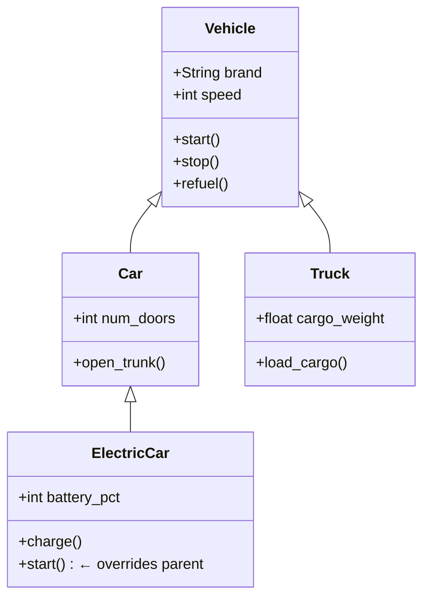

**Why it matters:** Write common logic once. Reuse it everywhere. An `ElectricCar` inherits `stop()` and `get_speed()` for free — but overrides `start()` to skip fuel checks.

---

### Pillar 3: Polymorphism — "same action, different behaviour"

The word "start" means something different for a gas car vs electric car vs motorcycle. But from the outside, you just say `.start()` and it figures it out correctly.

```python
class Vehicle:
    def start(self):
        print("Starting vehicle...")

class Car(Vehicle):
    def start(self):
        print("Check fuel → Turn ignition → Vroom!")

class ElectricCar(Vehicle):
    def start(self):
        print("Check battery → Silent motor hum")

class Motorcycle(Vehicle):
    def start(self):
        print("Kick start → ROAR!")

# The magic — same code, different behaviour
vehicles = [Car(), ElectricCar(), Motorcycle()]
for v in vehicles:
    v.start()   # Each one does the right thing automatically
```

```
Output:
  Car        → "Check fuel → Turn ignition → Vroom!"
  ElectricCar → "Check battery → Silent motor hum"
  Motorcycle  → "Kick start → ROAR!"
```

**Why it matters:** You can write one generic function that works with any vehicle — past, present, or future — without changing the function.

---

### Pillar 4: Abstraction — "show what matters, hide what doesn't"

When you drive, you use the steering wheel. You don't need to know how the steering wheel connects to the wheels via the rack-and-pinion mechanism. **Abstraction = define WHAT something does, not HOW.**

```python
from abc import ABC, abstractmethod

class Vehicle(ABC):           # Abstract class = blueprint
    @abstractmethod
    def start(self):          # Abstract method = must be implemented by child
        pass

    @abstractmethod
    def calculate_range(self):
        pass

class Car(Vehicle):
    def start(self):
        print("Gas car starting")

    def calculate_range(self):
        return self.__fuel * 12  # 12km per litre

class ElectricCar(Vehicle):
    def start(self):
        print("Electric car starting")

    def calculate_range(self):
        return self.__battery * 5  # 5km per % battery
```

**Why it matters:** You can swap one vehicle type for another without breaking anything. The caller only knows "this is a Vehicle that can start() and has a range" — not how it works internally.

---

### OOP Quick Reference

| Pillar            | Analogy                                              | What it prevents                               |
| ----------------- | ---------------------------------------------------- | ---------------------------------------------- |
| **Encapsulation** | Dashboard hides engine wiring                        | Accidental data corruption                     |
| **Inheritance**   | Children inherit parents' traits                     | Copy-pasting the same code everywhere          |
| **Polymorphism**  | Light switch works the same regardless of which bulb | Endless if/else chains                         |
| **Abstraction**   | Steering wheel hides rack-and-pinion                 | Forcing callers to know implementation details |

---

## 3. SOLID Principles — the 5 commandments of good design

SOLID is an acronym for 5 rules that, if you follow them, your code will be easy to extend, test, and fix. Most code rot (messy code that nobody wants to touch) happens because one of these is violated.

```
S — Single Responsibility Principle
O — Open/Closed Principle
L — Liskov Substitution Principle
I — Interface Segregation Principle
D — Dependency Inversion Principle
```

---

### S — Single Responsibility: "one class, one job"

**Analogy:** A chef cooks. A waiter serves. A cashier charges. You don't hire one person who does ALL THREE — it becomes chaos when they're busy, and when they quit, you lose three jobs at once.

**Bad:**

```python
class User:
    def get_user(self, id): ...
    def save_user(self, user): ...
    def format_user_as_json(self): ...      # ← formatting is a different job
    def send_welcome_email(self, user): ... # ← emailing is a different job
```

**Good:**

```python
class UserRepository:              # Job: data access
    def get_user(self, id): ...
    def save_user(self, user): ...

class UserSerializer:              # Job: formatting
    def to_json(self, user): ...

class EmailService:                # Job: sending emails
    def send_welcome(self, user): ...
```

**The test:** Can you describe what this class does in ONE sentence without using "and"? If not, it has too many responsibilities.

---

### O — Open/Closed: "open to add, closed to change"

**Analogy:** A phone case is designed so you can ADD new accessories (stands, wallets) without modifying the phone itself. You extend it, you don't crack it open.

**Bad:** Every time you add a new payment method, you modify existing code:

```python
class PaymentProcessor:
    def process(self, method, amount):
        if method == "credit_card":
            # credit card logic
        elif method == "paypal":
            # paypal logic
        elif method == "bitcoin":       # ← every new method = edit this class
            # bitcoin logic
```

**Good:** New payment type = new class, original code untouched:

```python
class PaymentMethod(ABC):
    @abstractmethod
    def pay(self, amount): pass

class CreditCard(PaymentMethod):
    def pay(self, amount): print(f"Charging card ${amount}")

class PayPal(PaymentMethod):
    def pay(self, amount): print(f"PayPal transfer ${amount}")

class Bitcoin(PaymentMethod):          # ← just add a new class
    def pay(self, amount): print(f"BTC transfer ${amount}")

class PaymentProcessor:                # ← this class NEVER changes
    def process(self, method: PaymentMethod, amount):
        method.pay(amount)
```

---

### L — Liskov Substitution: "children must behave like parents promised"

**Analogy:** If a contract says "any vehicle can be rented", a customer should be able to get ANY vehicle — car, van, truck — and drive it normally. If they get a "vehicle" that doesn't have a steering wheel, the contract is broken.

**The rule:** If class B extends class A, you should be able to use B anywhere A is expected — without anything breaking.

**Bad — violates Liskov:**

```python
class Rectangle:
    def set_width(self, w): self.width = w
    def set_height(self, h): self.height = h
    def area(self): return self.width * self.height

class Square(Rectangle):
    def set_width(self, w):
        self.width = w
        self.height = w   # <- Square forces height = width

    def set_height(self, h):
        self.width = h    # <- This breaks any code that set width/height separately
        self.height = h

# This code now gives WRONG answer when Square is used instead of Rectangle:
def test_area(rect: Rectangle):
    rect.set_width(4)
    rect.set_height(5)
    print(rect.area())  # Should print 20... Square prints 25!
```

**Fix:** Don't inherit — use a common interface instead:

```python
class Shape(ABC):
    @abstractmethod
    def area(self): pass

class Rectangle(Shape):
    def __init__(self, w, h): ...
    def area(self): return self.width * self.height

class Square(Shape):
    def __init__(self, s): ...
    def area(self): return self.side ** 2
```

---

### I — Interface Segregation: "don't force classes to implement what they don't use"

**Analogy:** A job description for "office worker" that includes surgeon duties, pilot certification, and cooking skills is absurd. Each role should only require what that role actually needs.

**Bad:**

```python
class Animal(ABC):
    @abstractmethod
    def eat(self): pass
    @abstractmethod
    def fly(self): pass    # ← Dogs can't fly
    @abstractmethod
    def swim(self): pass   # ← Eagles can't swim well

class Dog(Animal):
    def eat(self): ...
    def fly(self): raise NotImplementedError("Dogs can't fly!")  # ← embarrassing
    def swim(self): ...
```

**Good — split the interface:**

```python
class CanEat(ABC):
    @abstractmethod
    def eat(self): pass

class CanFly(ABC):
    @abstractmethod
    def fly(self): pass

class CanSwim(ABC):
    @abstractmethod
    def swim(self): pass

class Dog(CanEat, CanSwim):  # Dog only implements what it CAN do
    def eat(self): ...
    def swim(self): ...

class Eagle(CanEat, CanFly):
    def eat(self): ...
    def fly(self): ...
```

---

### D — Dependency Inversion: "depend on abstractions, not concrete classes"

**Analogy:** Your laptop has a USB port. It doesn't care what specific device you plug in — mouse, keyboard, external drive. It just knows "this is a USB device". If it was wired directly to one specific mouse, you could never change mice.

**Bad — tightly coupled:**

```python
class MySQLDatabase:
    def save(self, data): print("Saving to MySQL")

class UserService:
    def __init__(self):
        self.db = MySQLDatabase()  # ← hardwired to MySQL forever

    def create_user(self, name):
        self.db.save(name)
```

**Good — depends on abstraction:**

```python
class Database(ABC):
    @abstractmethod
    def save(self, data): pass

class MySQLDatabase(Database):
    def save(self, data): print("Saving to MySQL")

class MongoDatabase(Database):
    def save(self, data): print("Saving to MongoDB")

class UserService:
    def __init__(self, db: Database):   # ← accepts any Database
        self.db = db

    def create_user(self, name):
        self.db.save(name)

# Now you can swap databases without touching UserService at all:
service = UserService(MySQLDatabase())
service = UserService(MongoDatabase())   # works just as well
```

---

### SOLID Summary

| Principle                 | One Line Summary                  | Red Flag It's Violated                     |
| ------------------------- | --------------------------------- | ------------------------------------------ |
| **Single Responsibility** | One class, one job                | Class name has "And" in it                 |
| **Open/Closed**           | Add new code, don't edit old      | Long if/elif chains for types              |
| **Liskov**                | Child can stand in for parent     | Child throws "not supported"               |
| **Interface Segregation** | Small focused interfaces          | Implementing empty/mock methods            |
| **Dependency Inversion**  | Depend on interfaces, not classes | `new ConcreteClass()` inside another class |

---

## 4. UML Diagrams — drawing your code before writing it

UML (Unified Modeling Language) is a visual language for describing code structure and flow. In an LLD interview, you're expected to sketch a class diagram before writing a single line.

### Class Diagram — the most important one

A class diagram shows:

- **Classes** (boxes) — what objects exist
- **Attributes** — what data they hold
- **Methods** — what they do
- **Relationships** — how they connect

```
╔════════════════════════════╗
║       ClassName             ║  ← Class name (top section)
╠════════════════════════════╣
║  - private_attr: type       ║  ← Attributes (middle section)
║  + public_attr: type        ║  - = private, + = public, # = protected
╠════════════════════════════╣
║  + method_name(args): type  ║  ← Methods (bottom section)
║  - private_method(): void   ║
╚════════════════════════════╝
```

### Relationship arrows — the 5 types

```
╔══════════════════════════════════════════════════════════════════════╗
║  SYMBOL          NAME               MEANING / ANALOGY               ║
╠══════════════════════════════════════════════════════════════════════╣
║  A ──────▷ B     Inheritance        A IS-A B (Car is a Vehicle)      ║
║  A ·······▷ B    Realization        A implements interface B         ║
║  A ─────── B     Association        A USES B (Teacher teaches Class) ║
║  A ◇─────── B    Aggregation        A HAS B, B can exist alone       ║
║                                     (Library HAS Books)              ║
║  A ◆─────── B    Composition        A HAS B, B cannot exist alone    ║
║                                     (House HAS Rooms — no house,     ║
║                                      no room)                         ║
╚══════════════════════════════════════════════════════════════════════╝
```

### Example: Parking Lot class diagram

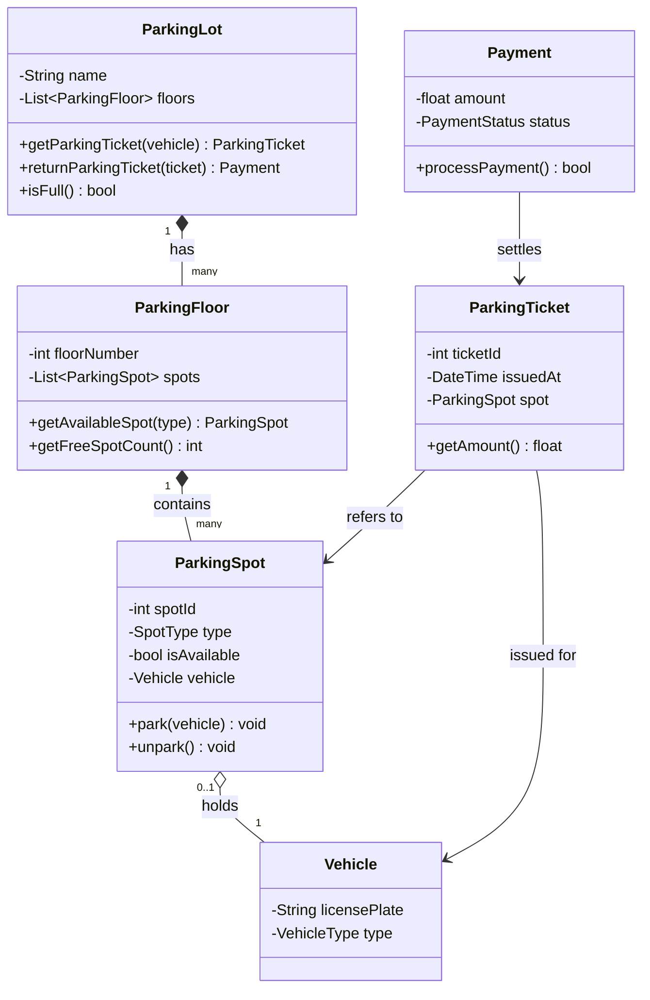

---

## 5. Design Patterns — proven solutions to common problems

A design pattern is a **reusable solution template** for a commonly occurring problem. They don't give you copy-paste code — they give you a _way of thinking_ about the problem.

There are 23 classic patterns (from the famous "Gang of Four" book), grouped into 3 categories:

```
╔══════════════════════════════════════════════════════════════════════╗
║  CREATIONAL         STRUCTURAL          BEHAVIORAL                   ║
║  (how to CREATE)    (how to CONNECT)    (how to COMMUNICATE)         ║
╠══════════════════════════════════════════════════════════════════════╣
║  Singleton          Adapter             Observer                     ║
║  Factory Method     Decorator           Strategy                     ║
║  Abstract Factory   Facade              Command                      ║
║  Builder            Proxy               Iterator                     ║
║  Prototype          Composite           State                        ║
║                     Bridge              Template Method              ║
╚══════════════════════════════════════════════════════════════════════╝
```

---

## 6. Creational Patterns — how objects are born

These patterns deal with object creation. The goal: **make object creation flexible and controlled.**

---

### Singleton — "there can only be one"

**Problem:** Some things should only exist once. A printer manager, a database connection pool, a configuration manager. If you accidentally create two, you get chaos (two printers fighting over jobs, two configs with different values).

**Analogy:** The country has ONE president. You don't create a new one every time someone wants to talk to the president — you always get the same one.

```python
class DatabaseConnection:
    _instance = None   # class-level variable — shared by all

    def __new__(cls):
        if cls._instance is None:              # first time only
            cls._instance = super().__new__(cls)
            cls._instance.connection = cls._connect_to_db()
        return cls._instance                   # always returns the same one

    @staticmethod
    def _connect_to_db():
        print("Connecting to database... (this only happens once)")
        return "connection_object"

# Test:
db1 = DatabaseConnection()
db2 = DatabaseConnection()
print(db1 is db2)   # True — same object!
```

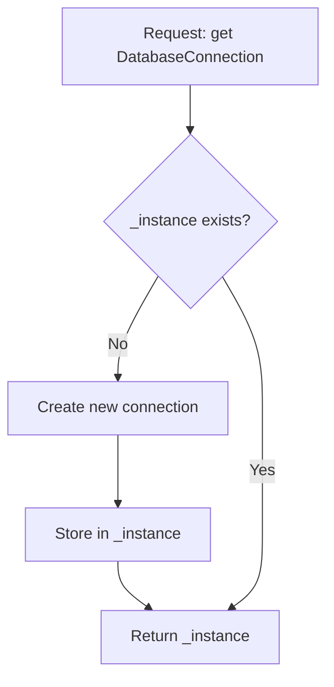

**When to use:** Logger, config, DB connection pool, thread pool.
**Warning:** Singleton makes testing hard (global state). Use it only when truly only one instance should exist.

---

### Factory Method — "let subclasses decide what to create"

**Problem:** You need to create objects, but you don't want the calling code to know which specific class gets created — you want that decision made elsewhere.

**Analogy:** You order "a coffee" at a cafe. You don't go behind the counter and make it yourself. The CAFE decides whether to use machine A or B, which beans, which technique.

```python
class Notification(ABC):
    @abstractmethod
    def send(self, message): pass

class EmailNotification(Notification):
    def send(self, msg): print(f"Email: {msg}")

class SMSNotification(Notification):
    def send(self, msg): print(f"SMS: {msg}")

class PushNotification(Notification):
    def send(self, msg): print(f"Push: {msg}")

class NotificationFactory:
    @staticmethod
    def create(notification_type: str) -> Notification:
        if notification_type == "email":
            return EmailNotification()
        elif notification_type == "sms":
            return SMSNotification()
        elif notification_type == "push":
            return PushNotification()
        raise ValueError(f"Unknown type: {notification_type}")

# Calling code never knows which class it's getting:
notif = NotificationFactory.create("email")
notif.send("Your order has shipped!")
```

**When to use:** When object creation logic would clutter your main code. When you need to switch implementations based on config, environment, or user type.

---

### Builder — "construct complex objects step by step"

**Problem:** Some objects have lots of optional fields. A constructor with 15 parameters is a nightmare — which one is which?

**Analogy:** Building a custom burger at Five Guys. You don't say "give me a burger" and get one fixed thing. You say: "patty yes, bun yes, cheese yes, lettuce no, pickles yes, sauce yes..." — you build it piece by piece.

```python
class Pizza:
    def __init__(self):
        self.size = None
        self.crust = None
        self.sauce = None
        self.toppings = []
        self.extra_cheese = False

    def __str__(self):
        return f"{self.size} pizza, {self.crust} crust, {self.sauce} sauce, toppings: {self.toppings}"

class PizzaBuilder:
    def __init__(self):
        self.pizza = Pizza()

    def size(self, size):
        self.pizza.size = size
        return self          # returns self so you can chain calls

    def crust(self, crust):
        self.pizza.crust = crust
        return self

    def sauce(self, sauce):
        self.pizza.sauce = sauce
        return self

    def add_topping(self, topping):
        self.pizza.toppings.append(topping)
        return self

    def extra_cheese(self):
        self.pizza.extra_cheese = True
        return self

    def build(self):
        return self.pizza

# Clean, readable, no mystery parameters:
my_pizza = (PizzaBuilder()
    .size("large")
    .crust("thin")
    .sauce("tomato")
    .add_topping("mushrooms")
    .add_topping("olives")
    .extra_cheese()
    .build())

print(my_pizza)
```

**When to use:** Objects with many optional fields, complex construction sequences, or when you want immutable objects.

---

## 7. Structural Patterns — how objects connect

These patterns deal with how classes and objects are composed to form larger structures.

---

### Adapter — "make incompatible things work together"

**Problem:** You have class A and class B. They need to work together but they have incompatible interfaces. You can't change either one.

**Analogy:** When you travel from India to the UK, your phone charger has a 2-pin plug but UK sockets are 3-pin. An **adapter** (plug converter) sits in between — no changes to the charger, no changes to the socket.

```python
# Old logging system — interface you can't change
class OldLogger:
    def write_log(self, message: str):
        print(f"[OLD LOG] {message}")

# New system expects this interface
class NewLogger(ABC):
    @abstractmethod
    def log(self, level: str, message: str): pass

# Adapter bridges the gap
class LoggerAdapter(NewLogger):
    def __init__(self, old_logger: OldLogger):
        self.old_logger = old_logger

    def log(self, level: str, message: str):
        # translates new interface to old
        self.old_logger.write_log(f"{level.upper()}: {message}")

# Now new code can use the old logger without knowing about it:
adapter = LoggerAdapter(OldLogger())
adapter.log("error", "Something went wrong")
# Output: [OLD LOG] ERROR: Something went wrong
```

**When to use:** Integrating legacy code, third-party libraries, or two systems with different interfaces.

---

### Decorator — "add features without changing the original"

**Problem:** You want to add new behaviour to an object, but you don't want to change its class (maybe it's a library class you don't own).

**Analogy:** A plain coffee is a coffee. Add milk → it's a latte. Add vanilla syrup → vanilla latte. Each addition wraps the previous one. You didn't "modify" the coffee — you wrapped it.

```python
class Coffee(ABC):
    @abstractmethod
    def cost(self) -> float: pass

    @abstractmethod
    def description(self) -> str: pass

class SimpleCoffee(Coffee):
    def cost(self): return 2.0
    def description(self): return "Coffee"

# Each decorator wraps a Coffee object:
class MilkDecorator(Coffee):
    def __init__(self, coffee: Coffee):
        self._coffee = coffee

    def cost(self): return self._coffee.cost() + 0.5
    def description(self): return self._coffee.description() + ", Milk"

class VanillaDecorator(Coffee):
    def __init__(self, coffee: Coffee):
        self._coffee = coffee

    def cost(self): return self._coffee.cost() + 0.75
    def description(self): return self._coffee.description() + ", Vanilla"

# Build up the order by wrapping:
coffee = SimpleCoffee()
coffee = MilkDecorator(coffee)
coffee = VanillaDecorator(coffee)
coffee = MilkDecorator(coffee)  # double milk

print(coffee.description())  # Coffee, Milk, Vanilla, Milk
print(coffee.cost())         # 3.75
```

**When to use:** Adding features to objects at runtime, when subclassing would cause a class explosion (MilkCoffee, VanillaMilkCoffee, etc.).

---

### Facade — "a simple front door for a complicated system"

**Problem:** A subsystem has 10 classes with 50 methods. You only ever use 3 combinations. Writing all 10 classes every time you do something simple is exhausting.

**Analogy:** Your TV remote is a facade. Behind it: IR transmitter, signal encoder, button matrix, power circuits. You just press "Volume Up". You don't interact with the circuits directly.

```python
# Complex subsystem classes:
class DVDPlayer:
    def on(self): print("DVD on")
    def play(self, movie): print(f"Playing {movie}")

class Amplifier:
    def on(self): print("Amplifier on")
    def set_volume(self, v): print(f"Volume: {v}")
    def set_surround(self): print("Surround sound on")

class Projector:
    def on(self): print("Projector on")
    def set_input(self, src): print(f"Input: {src}")

class Lights:
    def dim(self, level): print(f"Lights at {level}%")

# Facade — one simple interface for the whole thing:
class HomeTheaterFacade:
    def __init__(self):
        self.dvd = DVDPlayer()
        self.amp = Amplifier()
        self.projector = Projector()
        self.lights = Lights()

    def watch_movie(self, movie):
        print("--- Movie Night Setup ---")
        self.lights.dim(10)
        self.projector.on()
        self.projector.set_input("DVD")
        self.amp.on()
        self.amp.set_volume(8)
        self.amp.set_surround()
        self.dvd.on()
        self.dvd.play(movie)

# Now instead of 8 lines, you write 1:
theater = HomeTheaterFacade()
theater.watch_movie("Inception")
```

---

### Proxy — "a middleman that controls access"

**Problem:** You want to control access to an object — add logging, caching, access checks, or delay expensive creation.

**Analogy:** Your company lawyer is a proxy for you in legal matters. Before anything reaches you, they vet it, handle what they can, and only escalate when needed.

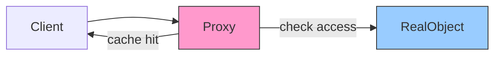

```python
class ImageLoader(ABC):
    @abstractmethod
    def display(self): pass

class RealImage(ImageLoader):
    def __init__(self, filename: str):
        self.filename = filename
        self._load()         # expensive disk operation

    def _load(self):
        print(f"Loading image from disk: {self.filename}")

    def display(self):
        print(f"Displaying: {self.filename}")

class ProxyImage(ImageLoader):    # same interface as RealImage
    def __init__(self, filename: str):
        self.filename = filename
        self._real_image = None  # NOT loaded yet

    def display(self):
        if self._real_image is None:     # lazy load — only when needed
            self._real_image = RealImage(self.filename)
        self._real_image.display()

# The expensive disk load only happens when display() is first called:
img = ProxyImage("photo.jpg")   # no disk access yet
img.display()                    # loads now
img.display()                    # uses cached real image
```

---

## 8. Behavioral Patterns — how objects talk to each other

These patterns deal with communication between objects — who talks to whom, and how.

---

### Observer — "notify me when something changes"

**Problem:** When one object changes state, many other objects need to know about it. But the first object shouldn't need to know _who_ is listening — it should just broadcast.

**Analogy:** You subscribe to a YouTube channel. When the creator uploads a video, YouTube notifies all subscribers. The creator doesn't individually call each subscriber — they just post, and YouTube handles notifications.

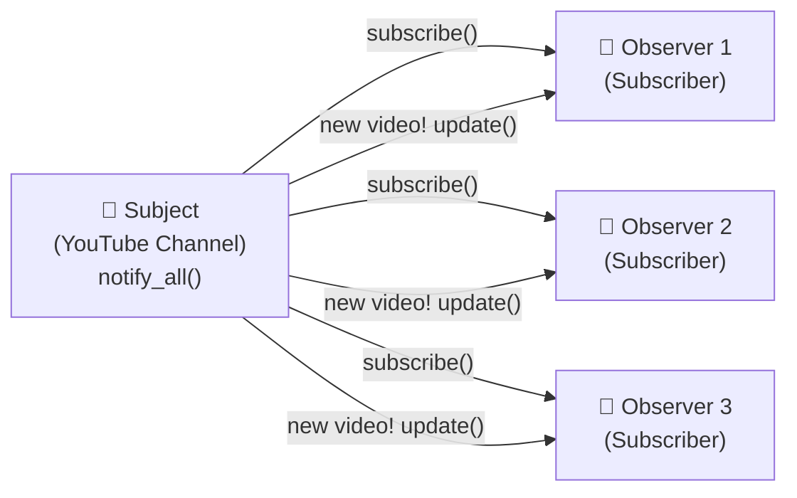

```python
class Subject:
    def __init__(self):
        self._observers = []
        self._state = None

    def subscribe(self, observer):
        self._observers.append(observer)

    def unsubscribe(self, observer):
        self._observers.remove(observer)

    def notify(self):
        for observer in self._observers:
            observer.update(self._state)

    def set_state(self, new_state):
        self._state = new_state
        self.notify()                    # automatically notify all

class EmailSubscriber:
    def update(self, state):
        print(f"Email notification: {state}")

class SMSSubscriber:
    def update(self, state):
        print(f"SMS notification: {state}")

# Usage:
stock = Subject()
stock.subscribe(EmailSubscriber())
stock.subscribe(SMSSubscriber())
stock.set_state("Apple stock is up 10%!")
# Both subscribers get notified automatically
```

**When to use:** Event systems, pub/sub, MVC (model notifying views), real-time dashboards.

---

### Strategy — "swap algorithms at runtime"

**Problem:** You have multiple ways to do the same thing, and you want to switch between them without if/else everywhere.

**Analogy:** Google Maps gives you routing options — Fastest, Shortest, Avoid Highways. The "route finding" behaviour can be swapped without rebuilding the app. Each option is a strategy.

```python
class SortStrategy(ABC):
    @abstractmethod
    def sort(self, data: list) -> list: pass

class BubbleSort(SortStrategy):
    def sort(self, data):
        print("Using Bubble Sort (good for small data)")
        return sorted(data)  # simplified

class QuickSort(SortStrategy):
    def sort(self, data):
        print("Using Quick Sort (good for large data)")
        return sorted(data)  # simplified

class MergeSort(SortStrategy):
    def sort(self, data):
        print("Using Merge Sort (stable, good for linked lists)")
        return sorted(data)  # simplified

class Sorter:
    def __init__(self, strategy: SortStrategy):
        self._strategy = strategy

    def set_strategy(self, strategy: SortStrategy):
        self._strategy = strategy      # swap at runtime!

    def sort(self, data):
        return self._strategy.sort(data)

# Can swap strategies without changing Sorter:
sorter = Sorter(BubbleSort())
sorter.sort([3, 1, 2])         # Bubble Sort

sorter.set_strategy(QuickSort())
sorter.sort([3, 1, 2])         # Now Quick Sort
```

---

### Command — "turn a request into an object"

**Problem:** You want to parameterize actions, queue them, undo them, or log them. A function call doesn't give you any of that — but a Command object does.

**Analogy:** A TV remote stores button-press actions as commands. "Volume Up" is one command. The remote doesn't know how the TV works — it just sends the command. The TV decides how to execute it. And you can undo (volume down).

```python
class Command(ABC):
    @abstractmethod
    def execute(self): pass

    @abstractmethod
    def undo(self): pass

class Light:
    def turn_on(self): print("Light ON")
    def turn_off(self): print("Light OFF")

class LightOnCommand(Command):
    def __init__(self, light: Light):
        self.light = light
    def execute(self): self.light.turn_on()
    def undo(self): self.light.turn_off()

class LightOffCommand(Command):
    def __init__(self, light: Light):
        self.light = light
    def execute(self): self.light.turn_off()
    def undo(self): self.light.turn_on()

class RemoteControl:
    def __init__(self):
        self.history = []

    def press(self, command: Command):
        command.execute()
        self.history.append(command)

    def undo_last(self):
        if self.history:
            self.history.pop().undo()

# Usage:
light = Light()
remote = RemoteControl()
remote.press(LightOnCommand(light))   # Light ON
remote.press(LightOffCommand(light))  # Light OFF
remote.undo_last()                    # Light ON  (undo the OFF)
```

**When to use:** Undo/redo systems, transaction queues, macro recording, task schedulers.

---

### State — "behaviour changes based on current state"

**Problem:** An object behaves very differently depending on what state it's in. Without this pattern, you end up with massive if/elif blocks checking the state everywhere.

**Analogy:** A traffic light. It has 3 states: Red, Green, Yellow. In each state, it behaves differently (what to do when timer fires, what colour shows, what's allowed). The light object delegates behaviour to its current state.

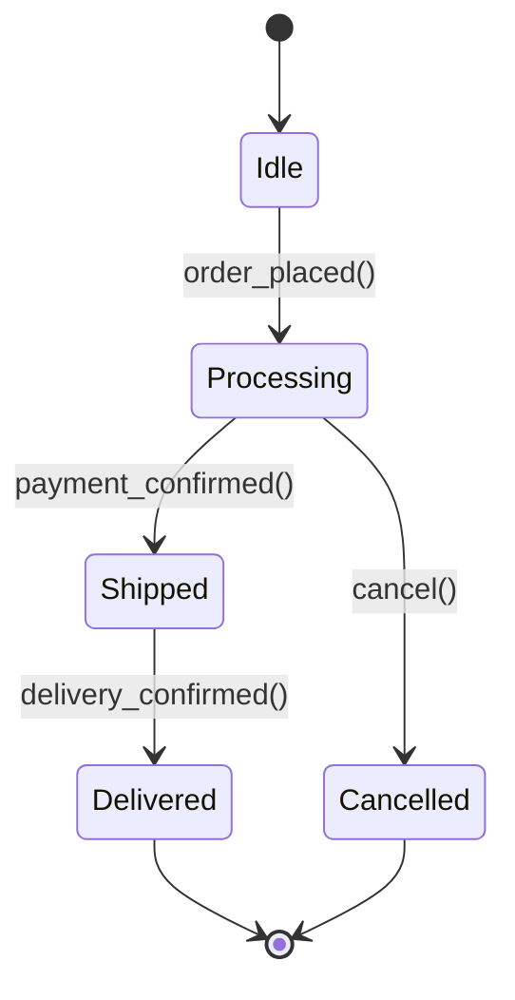

```python
class OrderState(ABC):
    @abstractmethod
    def next(self, order): pass

    @abstractmethod
    def cancel(self, order): pass

class IdleState(OrderState):
    def next(self, order):
        print("Order placed → Processing")
        order.state = ProcessingState()
    def cancel(self, order):
        print("Nothing to cancel")

class ProcessingState(OrderState):
    def next(self, order):
        print("Payment confirmed → Shipped")
        order.state = ShippedState()
    def cancel(self, order):
        print("Order cancelled")
        order.state = CancelledState()

class ShippedState(OrderState):
    def next(self, order):
        print("Delivered!")
        order.state = DeliveredState()
    def cancel(self, order):
        print("Can't cancel — already shipped")

class DeliveredState(OrderState):
    def next(self, order): print("Order complete")
    def cancel(self, order): print("Can't cancel — already delivered")

class CancelledState(OrderState):
    def next(self, order): print("Order is cancelled")
    def cancel(self, order): print("Already cancelled")

class Order:
    def __init__(self):
        self.state = IdleState()

    def next(self): self.state.next(self)
    def cancel(self): self.state.cancel(self)
```

---

## 9. Data Structures — picking the right tool

Every LLD decision eventually comes down to: what data structure do I use here? The right choice determines whether your solution is fast or slow, simple or complex.

### The decision cheat sheet

```
╔══════════════════════════════════════════════════════════════════════════════╗
║  IF YOU NEED...                      USE...          WHY                    ║
╠══════════════════════════════════════════════════════════════════════════════╣
║  Fast lookup by key                  HashMap         O(1) average           ║
║  Ordered key lookup / range queries  TreeMap         O(log n), sorted       ║
║  FIFO queue (first in, first out)    Queue/Deque     O(1) add and remove    ║
║  LIFO stack (last in, first out)     Stack           O(1) push and pop      ║
║  Unique elements only                HashSet         O(1) lookup            ║
║  Priority ordering (largest first)   Heap/PriorityQ  O(log n) insert        ║
║  Hierarchical data (folder tree)     Tree            Natural fit            ║
║  Shortest path between nodes         Graph + BFS     BFS = unweighted       ║
║  Cheapest path between nodes         Graph + Dijkstra Weighted graph        ║
║  Autocomplete / prefix search        Trie            O(word length)         ║
║  Sorted list with fast insert        Balanced BST    O(log n) all ops       ║
╚══════════════════════════════════════════════════════════════════════════════╝
```

### Data structures in real LLD problems

| LLD Problem                  | Key Data Structure                   | Why                                         |
| ---------------------------- | ------------------------------------ | ------------------------------------------- |
| **Parking Lot**              | HashMap (spot_id → spot)             | Fast lookup of spot by ID                   |
| **LRU Cache**                | HashMap + Doubly Linked List         | O(1) get AND O(1) evict                     |
| **Task Scheduler**           | Min-Heap (priority queue)            | Always pick the highest-priority task first |
| **Rate Limiter**             | Sliding window (Deque of timestamps) | Efficient window management                 |
| **Typeahead / Autocomplete** | Trie                                 | Shared prefix storage                       |
| **File System**              | Tree                                 | Natural hierarchy of folders                |
| **Snake and Ladder**         | Queue (BFS)                          | Shortest path traversal                     |
| **Twitter Feed**             | Heap (sorted by time)                | Merge N sorted feeds                        |

---

### LRU Cache — a classic problem explained

LRU = Least Recently Used. When the cache is full, evict the item that was used longest ago.

**Analogy:** Your desk has 5 books open at once. When you open a 6th, you close the one you haven't looked at for the longest — that's LRU.

**Why HashMap + Doubly Linked List?**

- HashMap: O(1) to GET any item by key
- Doubly Linked List: O(1) to move an item to "recently used" position and remove the tail

```
Most Recently Used                     Least Recently Used
HEAD ◄───────────────────────────────── TAIL
[D] ↔ [B] ↔ [A] ↔ [C]                (C gets evicted next)
 ↑ last accessed                       ↑ evict this one if cache full
```

```python
from collections import OrderedDict

class LRUCache:
    def __init__(self, capacity: int):
        self.capacity = capacity
        self.cache = OrderedDict()   # preserves insertion order

    def get(self, key: int) -> int:
        if key not in self.cache:
            return -1
        self.cache.move_to_end(key)  # mark as recently used
        return self.cache[key]

    def put(self, key: int, value: int):
        if key in self.cache:
            self.cache.move_to_end(key)
        self.cache[key] = value
        if len(self.cache) > self.capacity:
            self.cache.popitem(last=False)  # remove least recently used (front)
```

---

## 10. Clean Code — rules for writing readable code

> _"Any fool can write code that a computer can understand. Good programmers write code that humans can understand."_ — Martin Fowler

Clean code is not about being fancy. It's about being **obvious**.

---

### Rule 1: Names should tell the truth

```python
# BAD — what is d? what is l? what is t?
d = get_d()
if d > l:
    t()

# GOOD — reads like English
user_age = get_user_age()
if user_age > legal_drinking_age:
    allow_purchase()
```

**The test:** Can a new developer read your variable name and know exactly what it holds? If not, rename it.

---

### Rule 2: Functions should do ONE thing

```python
# BAD — this function does 5 things
def process_user(user_id):
    user = db.get(user_id)          # 1. fetch user
    user.age += 1                   # 2. mutate data
    db.save(user)                   # 3. save user
    email = format_email(user)      # 4. format email
    send_email(user.email, email)   # 5. send email

# GOOD — each function does one thing
def get_user(user_id): return db.get(user_id)
def increment_age(user): user.age += 1; return user
def save_user(user): db.save(user)
def notify_user_of_birthday(user): send_email(user.email, format_birthday_email(user))
```

---

### Rule 3: Functions should be small

If your function doesn't fit on one screen, it's doing too much. Break it up.

---

### Rule 4: Avoid magic numbers

```python
# BAD — what is 86400? what is 3?
if seconds > 86400:
    retry_count = 3

# GOOD — named constants explain intent
SECONDS_IN_A_DAY = 86400
MAX_RETRY_ATTEMPTS = 3

if seconds > SECONDS_IN_A_DAY:
    retry_count = MAX_RETRY_ATTEMPTS
```

---

### Rule 5: Comments explain WHY, not WHAT

```python
# BAD comment — it just restates what the code says
# increment i by 1
i += 1

# GOOD comment — explains a non-obvious reason
# Using Bresenham's algorithm here because trigonometric functions
# are too slow for real-time rendering at 60fps
x += error_correction_factor
```

---

### Rule 6: Don't repeat yourself (DRY)

If you find yourself writing the same logic twice, extract it into a function. Three times? Definitely a function.

```python
# BAD — same validation duplicated
def create_user(name, email):
    if not name or len(name) < 2:
        raise ValueError("Invalid name")
    if "@" not in email:
        raise ValueError("Invalid email")
    ...

def update_user(name, email):
    if not name or len(name) < 2:  # duplicate!
        raise ValueError("Invalid name")
    if "@" not in email:            # duplicate!
        raise ValueError("Invalid email")
    ...

# GOOD — extracted to one place
def validate_user_input(name, email):
    if not name or len(name) < 2:
        raise ValueError("Invalid name")
    if "@" not in email:
        raise ValueError("Invalid email")

def create_user(name, email):
    validate_user_input(name, email)
    ...

def update_user(name, email):
    validate_user_input(name, email)
    ...
```

---

## 11. Concurrency — doing multiple things at once

Concurrency is what happens when multiple threads run at the same time and access shared data. If not handled carefully, you get **race conditions** — bugs that only appear sometimes and are nearly impossible to reproduce.

---

### What's a race condition?

**Analogy:** You and your partner both check your joint bank account — it says £100. You both go to an ATM at the exact same moment and each withdraw £100. Both ATMs see £100, approve both withdrawals, and now your account is at -£100.

```
╔══════════════════════════════════════════════════════════════════════╗
║  Thread 1                 Thread 2              Balance              ║
╠══════════════════════════════════════════════════════════════════════╣
║  Read balance = 100                             100                  ║
║                           Read balance = 100   100                   ║
║  balance = 100 - 50                             100 (not updated yet)║
║                           balance = 100 - 50   100 (not updated yet)║
║  Write balance = 50                             50                   ║
║                           Write balance = 50   50  ← WRONG! Should  ║
║                                                     be 0             ║
╚══════════════════════════════════════════════════════════════════════╝
```

---

### Mutex (Lock) — "one at a time please"

```python
import threading

class BankAccount:
    def __init__(self, balance):
        self.balance = balance
        self._lock = threading.Lock()   # the mutex

    def withdraw(self, amount):
        with self._lock:               # only one thread enters at a time
            if self.balance >= amount:
                self.balance -= amount
                return True
            return False
```

The `with self._lock` block ensures only ONE thread can modify the balance at a time. The second thread waits until the first one is done.

---

### Deadlock — "everyone is waiting for everyone"

**Analogy:** Thread 1 holds Lock A, needs Lock B. Thread 2 holds Lock B, needs Lock A. Both wait forever. This is a deadlock.

```
╔══════════════════════════════════════════════════╗
║  Thread 1 holds Lock A, waiting for Lock B        ║
║  Thread 2 holds Lock B, waiting for Lock A        ║
║                                                   ║
║  Result: Both wait forever. Nothing happens.      ║
╚══════════════════════════════════════════════════╝
```

**Prevention:** Always acquire locks in the same order. If every thread acquires Lock A before Lock B, deadlock is impossible.

---

### Thread-Safe Singleton (Double-Checked Locking)

```python
import threading

class Singleton:
    _instance = None
    _lock = threading.Lock()

    @classmethod
    def get_instance(cls):
        if cls._instance is None:             # First check (no lock needed)
            with cls._lock:
                if cls._instance is None:     # Second check (inside lock)
                    cls._instance = cls()
        return cls._instance
```

**Why double-check?** After the first check, two threads might both see `None` and try to enter. The second check inside the lock ensures only one creates the instance.

---

## 12. Common LLD Interview Problems

These are the most frequently asked LLD design problems in interviews. For each, we show the key classes and relationships.

---

### Problem 1: Design a Parking Lot

**Understand the requirements first:**

- Multiple floors, multiple spots per floor
- Spot types: Compact, Large, Motorcycle, Electric
- Track availability
- Issue tickets, calculate fees, process payment
- EV spots have chargers

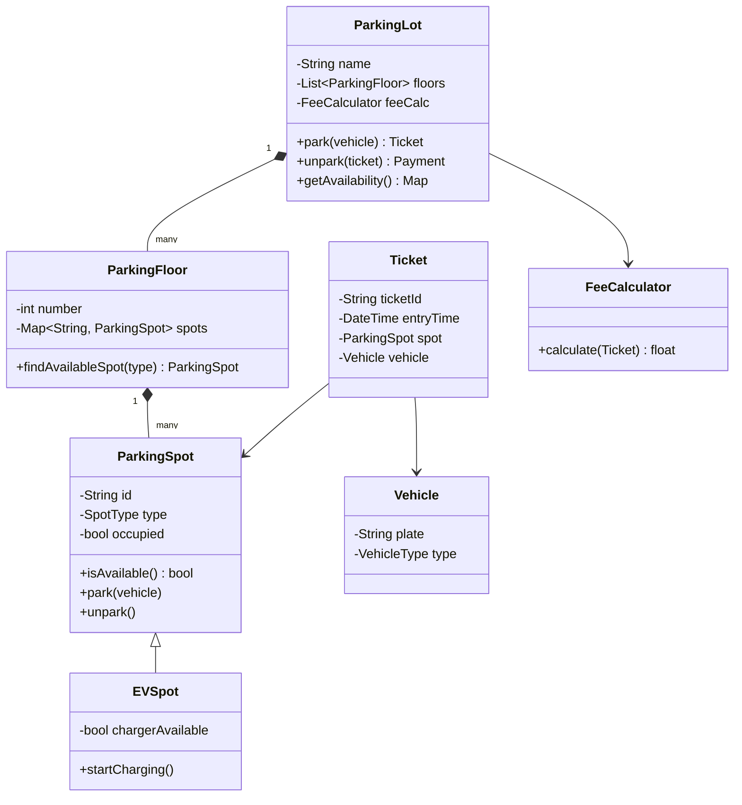

**Key design decisions to mention:**

- `ParkingSpot` is an abstract base — `EVSpot`, `HandicappedSpot` extend it
- `FeeCalculator` is separate (Strategy pattern) — easy to swap fee logic
- Use a `HashMap<SpotType, List<ParkingSpot>>` per floor for O(1) spot lookup by type

---

### Problem 2: Design an LRU Cache

Already covered in Section 9. Key points to add for interviews:

**Design decisions:**

- Thread-safe version: add `threading.Lock()` around all get/put operations
- Capacity: configurable at construction time
- Eviction policy: only LRU, or make it a strategy (LRU, LFU, FIFO)?

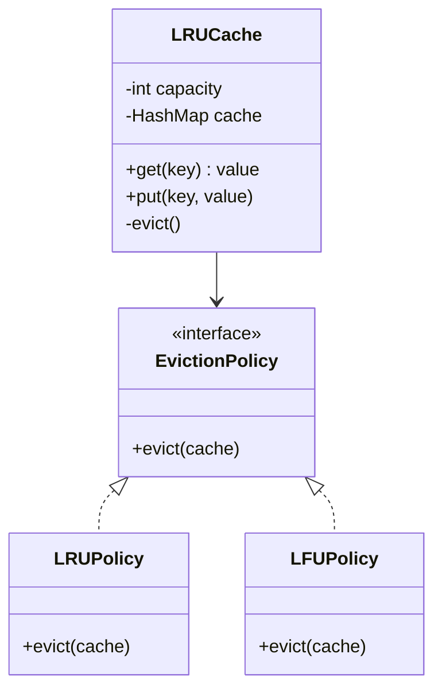

---

### Problem 3: Design a Library Management System

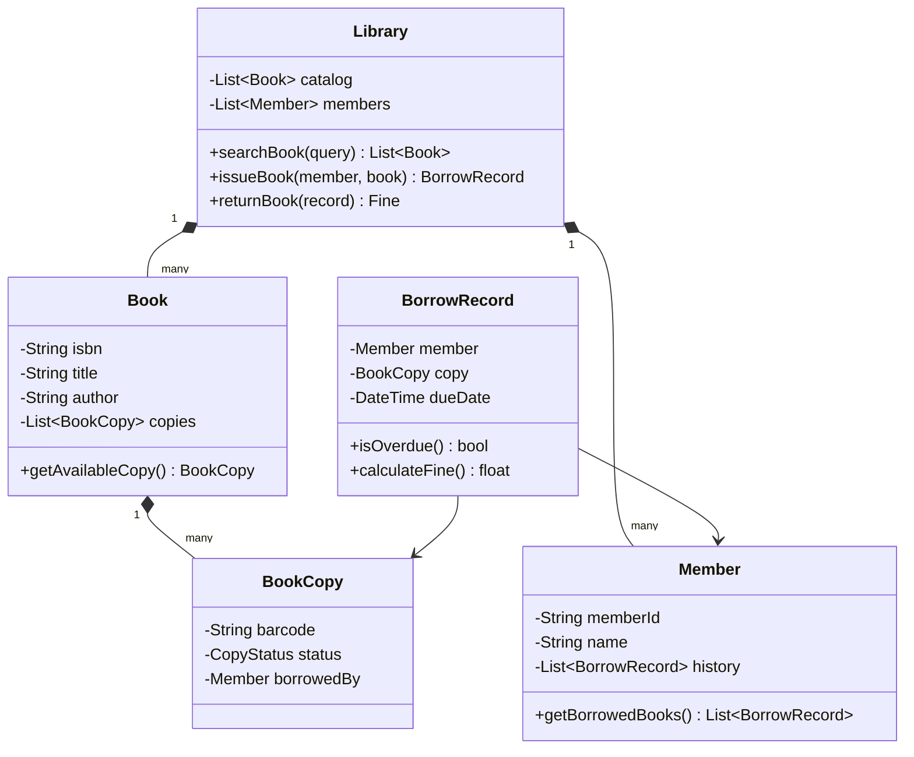

---

### Problem 4: Design a Hotel Booking System

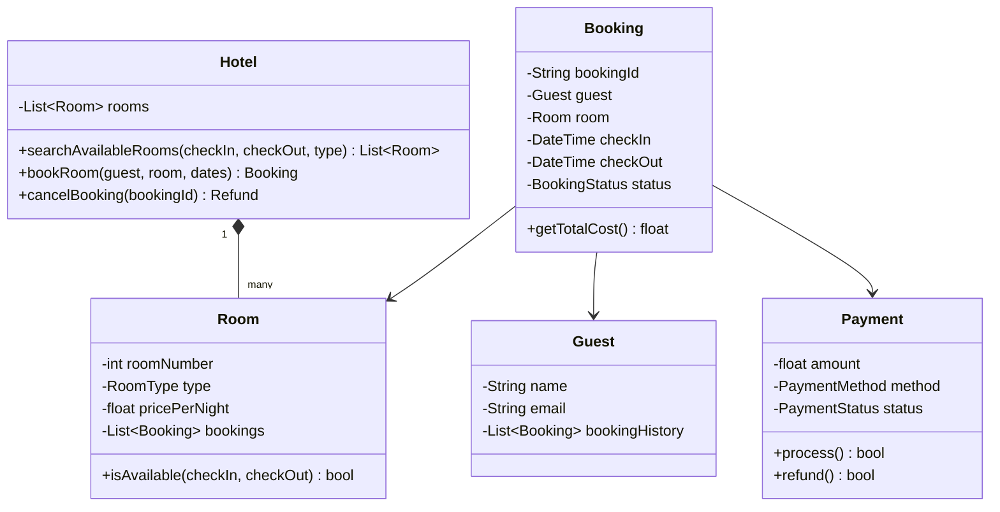

**Key design decisions:**

- Availability check: iterate over existing bookings for overlap. For scale, use a calendar bitmap or interval tree
- Use `BookingStatus` enum: PENDING, CONFIRMED, CHECKED_IN, CHECKED_OUT, CANCELLED
- Payment is separate from Booking (a booking can have multiple payment attempts)

---

### Problem 5: Design a Vending Machine

**States:** IDLE → ITEM_SELECTED → PAYMENT_PENDING → DISPENSING → CHANGE → IDLE

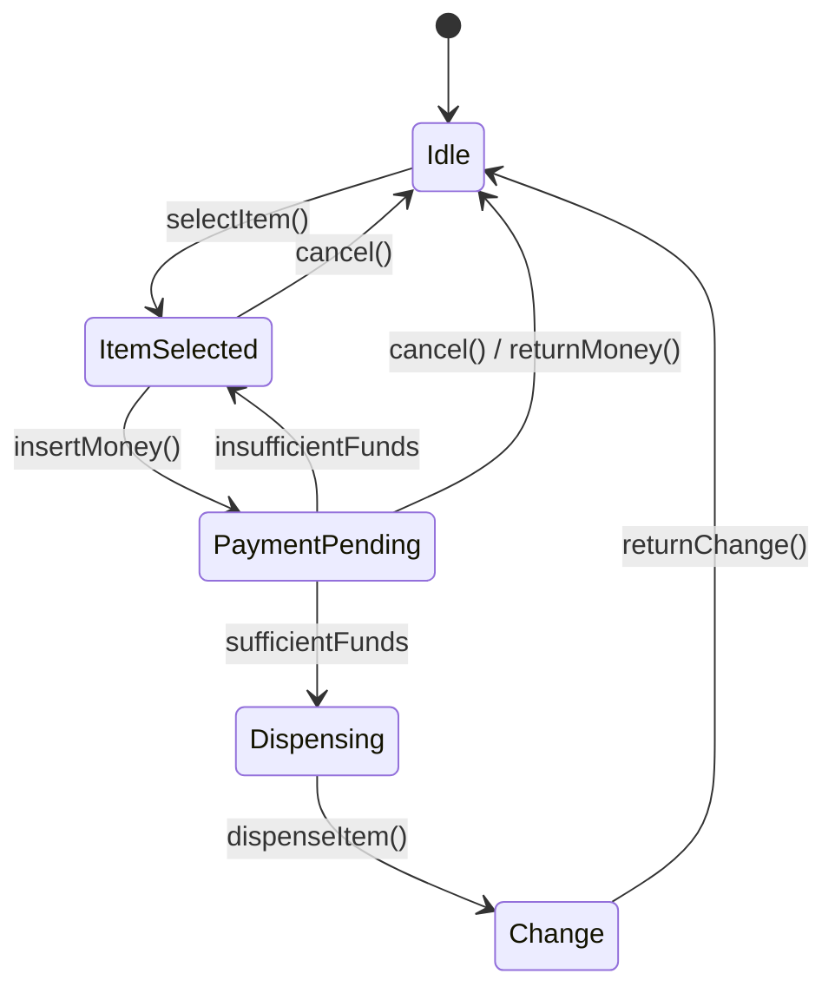

This is a classic **State Pattern** problem. Each state (Idle, ItemSelected, PaymentPending, Dispensing) is a class implementing a common interface.

---

## 13. How to Approach an LLD Interview

The biggest mistake in an LLD interview is jumping straight to code. Interviewers want to see your **thinking process**, not just your typing speed.

### The 5-Step LLD Interview Framework

```
╔══════════════════════════════════════════════════════════════════════════════╗
║  STEP 1: CLARIFY REQUIREMENTS (3-5 minutes)                                  ║
║                                                                              ║
║  Ask questions before you design anything:                                   ║
║  → "Should the parking lot support multiple entry/exit points?"              ║
║  → "Is this multi-threaded? Will multiple requests come at the same time?"  ║
║  → "What types of vehicles do we need to support?"                          ║
║  → "Are we designing just the core classes, or also the API layer?"         ║
╠══════════════════════════════════════════════════════════════════════════════╣
║  STEP 2: IDENTIFY THE CORE ENTITIES (2-3 minutes)                           ║
║                                                                              ║
║  Find the nouns: ParkingLot, Floor, Spot, Vehicle, Ticket, Payment          ║
║  These become your classes.                                                  ║
╠══════════════════════════════════════════════════════════════════════════════╣
║  STEP 3: DEFINE RELATIONSHIPS (3-5 minutes)                                  ║
║                                                                              ║
║  ParkingLot HAS-MANY Floors (composition)                                   ║
║  Floor HAS-MANY Spots (composition)                                         ║
║  Spot HOLDS zero or one Vehicle (association)                               ║
║  Vehicle IS-A (Car | Truck | Bike) (inheritance)                            ║
╠══════════════════════════════════════════════════════════════════════════════╣
║  STEP 4: DRAW THE CLASS DIAGRAM (5 minutes)                                  ║
║                                                                              ║
║  Sketch boxes (classes) with attributes and methods.                        ║
║  Add arrows for relationships.                                               ║
║  Identify which patterns apply: Strategy? Singleton? Observer?              ║
╠══════════════════════════════════════════════════════════════════════════════╣
║  STEP 5: WRITE THE CODE (15-20 minutes)                                      ║
║                                                                              ║
║  Start with interfaces / abstract classes.                                  ║
║  Write the core classes first (the ones everything depends on).             ║
║  Show enums for status fields (SpotType, VehicleType, PaymentStatus).       ║
║  Mention extensibility: "If we wanted to add EVSpot, we'd just inherit..."  ║
╚══════════════════════════════════════════════════════════════════════════════╝
```

---

### What interviewers are actually checking

| Interviewer checks    | What they want to see                                  |
| --------------------- | ------------------------------------------------------ |
| **OOP understanding** | Proper use of inheritance, interfaces, encapsulation   |
| **SOLID principles**  | Classes with single jobs, proper abstractions          |
| **Design patterns**   | Recognising where patterns help (don't force them)     |
| **Extensibility**     | Can you add a new feature without breaking everything? |
| **Thread safety**     | Do you mention concurrency where relevant?             |
| **Enums for states**  | Not string comparisons like `if status == "active"`    |
| **Clean naming**      | Variables and methods that tell a story                |

---

### Red flags that cost you the interview

```
✗ Jumping to code without a class diagram
✗ A class with 20 methods doing everything
✗ Using global variables instead of proper encapsulation
✗ if/elif chains for types (use polymorphism instead)
✗ Not asking clarifying questions
✗ No interfaces — everything is a concrete class
✗ Copy-paste logic in multiple methods
✗ Magic numbers instead of named constants
```

---

### Green flags that win you the interview

```
✓ "Let me clarify a few things before I start"
✓ Drawing the class diagram first
✓ "I'm using the Strategy pattern here because..."
✓ "This class has a single responsibility: it only handles..."
✓ "I'll make this an interface so we can swap implementations later"
✓ "If we need to support X in the future, we'd just add a new class here"
✓ Mentioning thread safety: "If this is multi-threaded, I'd add a lock here"
✓ Using enums for every status/type field
```

---

## 14. The LLD Cheat Sheet

### Pattern quick reference

| Pattern       | Category   | Problem it solves                         | Real-world use case                   |
| ------------- | ---------- | ----------------------------------------- | ------------------------------------- |
| **Singleton** | Creational | Only one instance should exist            | Logger, Config, DB connection pool    |
| **Factory**   | Creational | Decouple object creation from usage       | Notification service, Payment handler |
| **Builder**   | Creational | Complex objects with many optional fields | Query builder, Pizza order            |
| **Adapter**   | Structural | Connect incompatible interfaces           | Legacy system integration             |
| **Decorator** | Structural | Add features without modifying original   | Middleware chains, logging wrappers   |
| **Facade**    | Structural | Simple interface for complex subsystem    | SDK wrapper, Home automation          |
| **Proxy**     | Structural | Control access to an object               | Lazy loading, Access control, Caching |
| **Observer**  | Behavioral | Notify many listeners of state change     | Event systems, Pub/Sub, MVC           |
| **Strategy**  | Behavioral | Swap algorithms at runtime                | Sorting, Payment, Routing             |
| **Command**   | Behavioral | Encapsulate actions as objects            | Undo/redo, Task queue                 |
| **State**     | Behavioral | Change behaviour based on state           | Order lifecycle, Vending machine      |

---

### SOLID principles quick reference

| Principle                 | Ask yourself                                        | Fix                                  |
| ------------------------- | --------------------------------------------------- | ------------------------------------ |
| **Single Responsibility** | "Does this class do more than one thing?"           | Split into two classes               |
| **Open/Closed**           | "Do I need to edit this class to add a feature?"    | Extract to interface + add new class |
| **Liskov**                | "Does the child class break any parent promises?"   | Redesign the inheritance             |
| **Interface Segregation** | "Does this class implement methods it doesn't use?" | Split the interface                  |
| **Dependency Inversion**  | "Does this class create its own dependencies?"      | Inject them from outside             |

---

### LLD vs HLD decision table

| Question                             | LLD | HLD |
| ------------------------------------ | --- | --- |
| "What classes do we need?"           | ✅  | ❌  |
| "Which database to use?"             | ❌  | ✅  |
| "How do objects relate?"             | ✅  | ❌  |
| "How do services communicate?"       | ❌  | ✅  |
| "What methods does this class have?" | ✅  | ❌  |
| "How do we handle 1 million users?"  | ❌  | ✅  |
| "Singleton or Factory?"              | ✅  | ❌  |
| "Load balancer strategy?"            | ❌  | ✅  |

---

## 15. Glossary

| Term                     | Plain English Explanation                                                                                                         |
| ------------------------ | --------------------------------------------------------------------------------------------------------------------------------- |
| **Abstract Class**       | A blueprint class that can't be instantiated directly — only its children can be. It defines what methods children must implement |
| **Interface**            | A pure contract — just method signatures, zero implementation. Classes that implement it promise to provide those methods         |
| **Encapsulation**        | Bundling data and the methods that work on it together, and hiding the internals from the outside world                           |
| **Inheritance**          | A child class gets all the attributes and methods of the parent class automatically                                               |
| **Polymorphism**         | Different classes respond to the same method call in different ways — the right behaviour is picked automatically                 |
| **Abstraction**          | Hiding complexity and showing only what the user needs to know                                                                    |
| **SOLID**                | Five design principles: Single Responsibility, Open/Closed, Liskov Substitution, Interface Segregation, Dependency Inversion      |
| **Design Pattern**       | A named, reusable solution template for a commonly occurring programming problem                                                  |
| **Singleton**            | Ensures a class has only one instance ever created                                                                                |
| **Factory**              | A method or class that creates objects without the caller needing to know the exact class                                         |
| **Builder**              | Constructs complex objects step by step, with method chaining                                                                     |
| **Adapter**              | Wraps an existing class with a new interface so incompatible things can work together                                             |
| **Decorator**            | Wraps an object to add new behaviour without changing its class                                                                   |
| **Facade**               | A simplified interface that hides a complex subsystem behind one easy-to-use class                                                |
| **Proxy**                | A stand-in object that controls access to the real object                                                                         |
| **Observer**             | A pub/sub mechanism — one object broadcasts, many others receive                                                                  |
| **Strategy**             | Encapsulates a family of algorithms and makes them interchangeable at runtime                                                     |
| **Command**              | Wraps a request as an object so it can be queued, logged, or undone                                                               |
| **State**                | Allows an object to change its behaviour entirely when its internal state changes                                                 |
| **Composition**          | A "has-a" relationship where the child cannot exist without the parent (House has Rooms)                                          |
| **Aggregation**          | A "has-a" relationship where the child CAN exist independently (Library has Books)                                                |
| **Coupling**             | How much one class depends on another. Low coupling = good. High coupling = hard to change                                        |
| **Cohesion**             | How focused a class is. High cohesion = class does one thing well. Low cohesion = class does everything                           |
| **DRY**                  | Don't Repeat Yourself — never write the same logic in two places                                                                  |
| **Race Condition**       | A bug where the outcome depends on the unpredictable order of thread execution                                                    |
| **Deadlock**             | Two threads each waiting for the other to release a lock — stuck forever                                                          |
| **Mutex / Lock**         | A mechanism that ensures only one thread can access a critical section at a time                                                  |
| **Immutable**            | An object whose state cannot be changed after creation — thread-safe by nature                                                    |
| **Dependency Injection** | Passing dependencies into a class from outside, rather than the class creating them itself                                        |
| **LRU Cache**            | Least Recently Used — when cache is full, evict the item accessed least recently                                                  |
| **UML**                  | Unified Modeling Language — standard notation for drawing software diagrams                                                       |
| **Trie**                 | A tree data structure optimised for prefix lookups — used in autocomplete                                                         |
| **Heap**                 | A tree-based data structure where the top is always the min/max — used for priority queues                                        |

---

> _"Good software design is not about writing clever code. It's about writing code that the next person — or future you — can understand, modify, and trust."_

---

_Part of the AI_Projects learning series._
